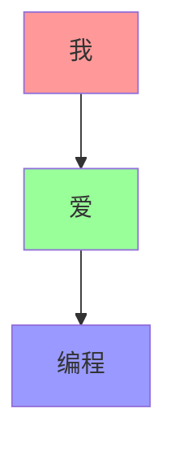
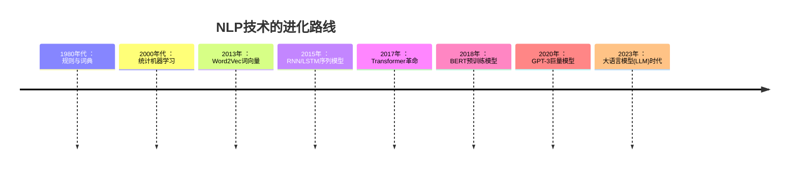
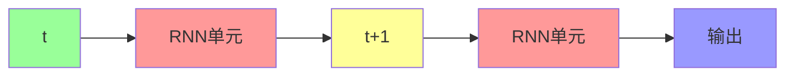
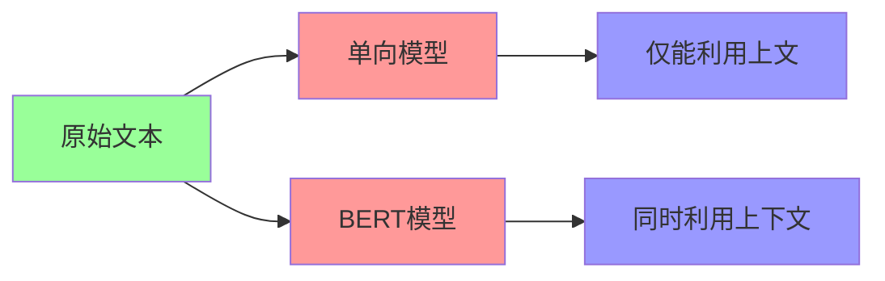
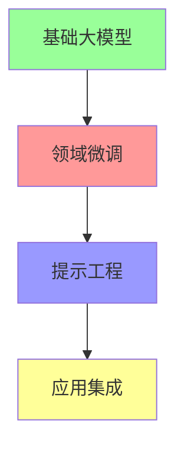
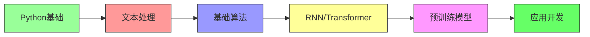

> # 自然语言处理（NLP）全景解析：从文字到智能的进化之路 📚
>> ***"人类创造语言来理解世界，现在我们在教机器理解人类语言" - NLP研究者的使命***

## 一、NLP基础：让机器"识字"的三步法
### 1. 分词：语言的基本拆解
```python
import jieba  # 中文分词库

text = "自然语言处理让计算机理解人类语言"
words = jieba.cut(text)

print("分词结果:", "/".join(words))
# 输出: 自然/语言/处理/让/计算机/理解/人类/语言
```
分词技术对比​​：
| 语言   | 分词技术       | 特点                     |
|--------|----------------|--------------------------|
| 英语   | 空格切分       | 简单直接                 |
| 中文   | Jieba/HanLP    | 需结合词典和规则         |
| 日语   | MeCab          | 复杂的助词分离           |

### 2. 词性标注：词语身份识别
```
句子: "我爱编程"
分析:
    我/代词  爱/动词  编程/名词
```

### 3. 句法分析：语言结构解析


## 二、词表示革命：从符号到意义
### 1. 传统方法：独热编码(One-Hot)
```python
词典: ["apple", "banana", "orange"]
编码:
    apple: [1, 0, 0]
    banana: [0, 1, 0]
    orange: [0, 0, 1]
```
**缺陷**​​：无法表达词义关系，维度灾难

### 2. 词嵌入(Word Embedding)：语义编码  

使用神经网络将词映射到低维空间：
```python
from gensim.models import Word2Vec

# 训练词向量模型
sentences = [["自然", "语言", "处理"], ["机器", "学习", "算法"]]
model = Word2Vec(sentences, vector_size=100, window=5, min_count=1)

# 获取词向量
vector = model.wv["语言"]
print(f"语言'的词向量维度: {vector.shape}")  # (100,)

# 计算相似度
similarity = model.wv.similarity("语言", "处理")
print(f"语言'与'处理'的语义相似度: {similarity:.2f}")
```
### 3. 词向量魔法：语义代数
```
vec(国王) - vec(男人) + vec(女人) ≈ vec(女王)
vec(巴黎) - vec(法国) + vec(日本) ≈ vec(东京)
```
## 三、NLP核心技术演进史

### 1. RNN/LSTM：记忆增强网络

**应用场景**​​：文本生成、情感分析

### 2. Transformer：注意力机制革命  
**​​核心创新​​**：自注意力机制
```
句子: "这只苹果手机很贵"
模型关注:
    "苹果" -> 60%关注"手机", 30%关注"贵"
    "贵" -> 70%关注"苹果", 25%关注"手机"
```
### 3. BERT：双向理解
与传统模型的对比:


## 四、现代NLP四大应用支柱
### 1. 文本分类与情感分析
```python
from transformers import pipeline

# 使用预训练情感分析模型
classifier = pipeline("sentiment-analysis")
result = classifier("这家餐厅的服务太棒了，食物也很美味！")

print(result)  
# [{'label': 'POSITIVE', 'score': 0.998}]
```
### 2. 机器翻译：打破语言壁垒
```
翻译流程：
中文 → 编码器 → 语义向量 → 解码器 → 英文
```
**多语言翻译实战**
```python
from transformers import MarianMTModel, MarianTokenizer

# 中译英
model_name = "Helsinki-NLP/opus-mt-zh-en"
tokenizer = MarianTokenizer.from_pretrained(model_name)
model = MarianMTModel.from_pretrained(model_name)

text = "自然语言处理正在改变世界"
translated = model.generate(**tokenizer(text, return_tensors="pt"))
output = tokenizer.decode(translated[0], skip_special_tokens=True)

print(output)  # "Natural language processing is changing the world"
```
### 3. 问答系统：知识检索专家
​​架构图​​：
```python
graph TD
    A[用户问题] --> B[问题解析]
    B --> C[知识库检索]
    C --> D[答案生成]
    D --> E[回答输出]
    
    style A fill:#9f9
    style E fill:#99f
```
### 4. 文本生成：机器的创作能力
GPT系列创作示例：
```python
from transformers import GPT2LMHeadModel, GPT2Tokenizer

tokenizer = GPT2Tokenizer.from_pretrained("gpt2")
model = GPT2LMHeadModel.from_pretrained("gpt2")

input_text = "在未来的世界里，人工智能"
input_ids = tokenizer.encode(input_text, return_tensors="pt")

# 生成文本
output = model.generate(
    input_ids, 
    max_length=100,
    num_return_sequences=1
)

print(tokenizer.decode(output[0], skip_special_tokens=True))
```
**输出示例​​**：
"在未来的世界里，人工智能将成为人类最强大的助手。它们不仅能处理复杂的计算任务，还能创造令人惊叹的艺术作品，甚至帮助科学家解决气候变化等全球性问题..."
## 五、NLP实战工具箱
### 1. 现代NLP开发栈
| 工具类型         | 代表工具               | 用途                  |
|------------------|------------------------|-----------------------|
| 基础库           | NLTK, SpaCy           | 文本预处理            |
| 深度学习框架     | PyTorch, TensorFlow    | 模型构建              |
| 预训练模型库     | Hugging Face           | 上千种预训练模型      |
| 可视化           | TensorBoard            | 训练过程监控          |

### 2. Hugging Face使用示例
```python
from transformers import AutoTokenizer, AutoModelForSequenceClassification

# 加载预训练模型和分词器
model_name = "bert-base-chinese"
tokenizer = AutoTokenizer.from_pretrained(model_name)
model = AutoModelForSequenceClassification.from_pretrained(model_name)

# 文本处理
inputs = tokenizer("NLP让计算机理解人类语言", return_tensors="pt")

# 模型推理
outputs = model(**inputs)
```
## 六、大语言模型（LLM）时代
### 大模型四层结构：

**ChatGPT类系统工作原理**：
```
输入 -> 文本编码 -> 大语言模型 -> 文本解码 -> 输出
                     ↑
              人类反馈强化学习
```
## 七、学习路线指南



**推荐学习路径**​​：

1. 掌握Python和基础文本处理
2. 学习Word2Vec和TextCNN
3. 深入理解Transformer架构
4. 使用Hugging Face实现BERT/GPT
5. 开发实际NLP应用：
- 智能客服机器人
- 新闻自动摘要系统
- 法律文书分析工具

> ***"自然语言处理不仅是技术挑战，更是人类理解自身思维方式的窗口" - NLP先驱的思考***
>> *现在就开始你的NLP之旅吧！从训练第一个词向量模型到构建聊天机器人，每一步都在拉近人与机器的距离。🚀*
