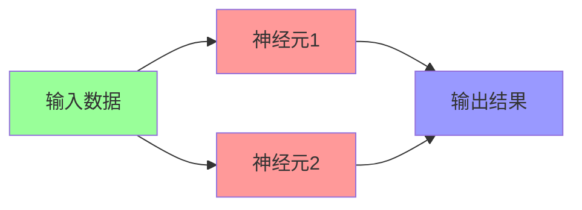
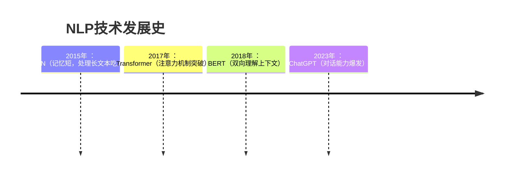
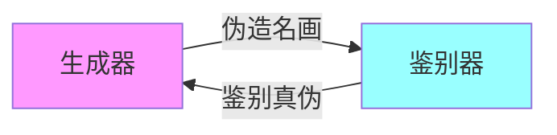

# 阶段2：深度学习入门指南 🚀
​​深度学习就像教婴儿认识世界​​：先认识形状（基础理论），再认人脸（计算机视觉），  
然后学说话（NLP），最后学会创作（生成模型）。下面带你看懂这个神奇世界👇

## 一、基础理论：神经网络的"骨骼"
### 核心三件套​​：
1. 神经网络​​
- 像人脑神经元网络：输入层（眼睛看）→ 隐藏层（大脑思考）→ 输出层（嘴巴说）
- 可视化理解：

2. 反向传播​​
- 学习过程：考试后老师批改试卷 → 告诉你哪里错了 → 下次改进
- 数学本质：从输出层倒推调整每个神经元的"重要性权重"
​​3. 正则化​​
- 防"死记硬背"：给学生划重点（降低复杂度），避免考试换题就挂科（过拟合）
- 常用方法：Dropout（随机屏蔽神经元）、L1/L2（控制权重数值）

### 📚 ​​学习资源​​：
《[深度学习](https://github.com/exacity/deeplearningbook-chinese/tree/master)》(花书) - AI领域的"圣经"，配奶茶慢慢啃效果更佳 ☕

## 二、计算机视觉：机器的"眼睛" 0.0
### 核心技术组合拳​​：
1. CNN（卷积神经网络）​​
**工作原理：像用放大镜分层扫描图片**
- 卷积层：识别局部特征（如猫耳朵、车轮）
- 池化层：压缩关键信息（去除非重点背景）
- 全连接层：综合判断（拼接特征得出结论）
2. ​​目标检测​​
- 经典模型：YOLO（You Only Look Once）

 **实时检测效果​​：**
```
输入：街道图片 → 输出：  
[汽车：坐标(x1,y1)  置信度98%]  
[行人：坐标(x2,y2)  置信度92%]
```
3. ​图像分割​​
- 医疗应用：CT片中自动标出肿瘤区域（像素级识别）

### 🎥 ​​学习资源​​：
[斯坦福CS231n课程](https://www.bilibili.com/video/BV1nJ411z7fe/)（B站有中文版）→ 看5节课就能自己写图像识别程序！

## 三、NLP：让机器懂人话 💬
### ​​关键技术演进​​：

1. RNN/Transformer​​
- RNN问题："我爱北京天安门"学到"天安门"时已忘记开头
- Transformer革新：同时关注所有词 → 理解"苹果"在水果/手机中的不同含义
2. ​​词嵌入(Word Embedding)​​
- 把词语变成数字密码
```
国王 - 男人 + 女人 = 女王
vec(巴黎) - vec(法国) + vec(日本) ≈ vec(东京)
```

### 📃 ​​学习资源​​：
BERT论文精读 + Hugging Face实战 → 3天搭建自己的文本情感分析器

## 四、生成模型：机器的"想象力" 🎨  
### 三大创作引擎​​：
| 技术        | 代表作       | 创作能力                     |
|-------------|-------------|-----------------------------|
| GAN         | 人脸生成     | 图像生成/换脸                |
| Diffusion   | DALLE 2     | 文生图（输入"星空下的熊猫"出图） |
| LLMs        | ChatGPT     | 写诗/编码/聊人生             |

**GAN工作原理​​：**

- 生成器：像造假币的团队
- 鉴别器：像银行验钞机
- 双方对抗提升，直到假币无法被识别

### 🤖 ​​学习资源​​：
Hugging Face平台（AI界GitHub）→ 直接在线体验Stable Diffusion生成图片！

**💡 ​​关键提示**​​：深度学习≠魔法！先掌握基础理论再攻具体方向，遇到公式别怕→先跑通代码再回头理解理论效果更佳！
