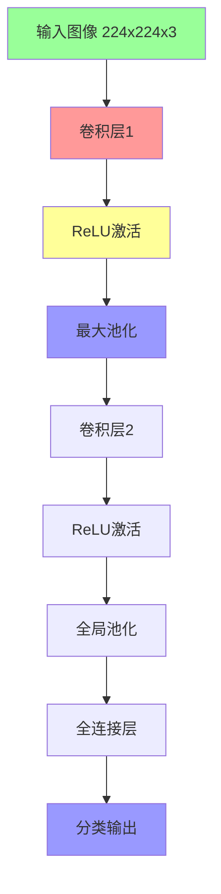
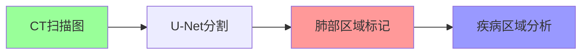
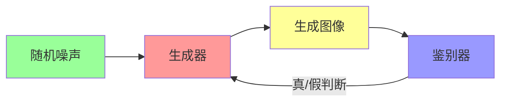
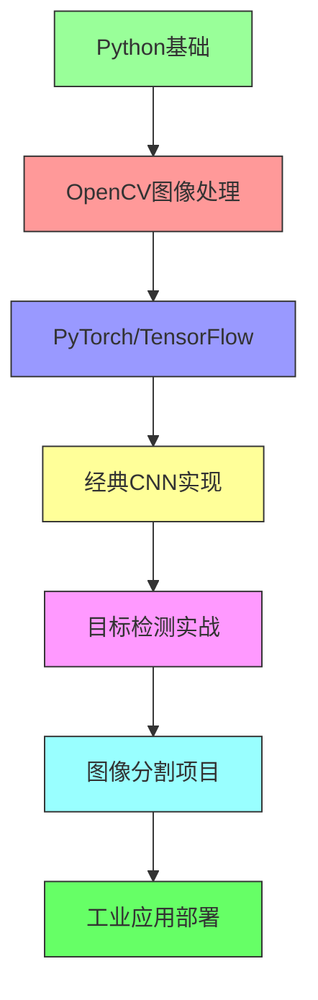

> # 计算机视觉超全解析：从像素到智能识别的奇妙之旅 🌟  

## 一、视觉世界的数字密码  

计算机视觉的第一步是把图像转化为数字语言：
```python
import numpy as np
from PIL import Image

# 加载一张猫咪图片
image = Image.open("cat.jpg")
pixel_data = np.array(image)

print(f"图片尺寸: {pixel_data.shape}")  # 例如 (480, 640, 3)
print("左上角像素值:", pixel_data[0, 0])  # 例如 [255, 200, 150]
```
像素矩阵揭秘​​：
```
RGB通道详解：
[ R: 255, G: 200, B: 150 ] → 亮橙红色
```

### 高级技巧：通过以下操作增强图像：
- Grayscale = 0.299*R + 0.587*G + 0.114*B (灰度转换)

- Histogram equalization (直方图均衡化提高对比度)

## 二、特征工程：机器如何"看懂"图像
计算机需要提取图像的特征模式：  

| 传统方法          | 深度学习方法       | 特点对比                          |
|-------------------|--------------------|----------------------------------|
| SIFT旋转不变特征   | CNN卷积核          | 传统方法需手工设计，CNN自动学习    |
| HOG行人检测特征    | 注意力机制         | HOG只对特定目标有效，CNN泛化强    |
| LBP纹理特征        | 端到端特征提取     | 传统方法计算快，CNN精度高         |  

**卷积操作可视化：**
```python
原始图像： [1 1 1 0 0]
卷积核：   [1 0 -1]
结果：     [ (1 * 1)+(1 * 0)+(1*(-1)) = 0 ]
           [ (1 * 1)+(1 * 0)+(0*(-1)) = 1 ] → 边缘检测！
```
## 三、CNN：视觉处理的革命者
卷积神经网络工作原理全解析：

**核心组件详解​​：**

​​1. 卷积层​​：
- 使用3x3滤波器扫描图像
- 提取局部特征（边缘、纹理等）
- 多个滤波器组合检测复杂特征
2. ​​池化层​​：
- 降维操作（通常2x2区域取最大值）
- 增强位置不变性
- 保留重要特征
​​3. 实战代码​​（PyTorch版）：
```python
import torch
import torch.nn as nn

class SimpleCNN(nn.Module):
    def __init__(self):
        super().__init__()
        self.conv1 = nn.Conv2d(3, 32, 3) # 3通道输入, 32个卷积核, 3x3大小
        self.pool = nn.MaxPool2d(2, 2)  # 2x2池化
        self.conv2 = nn.Conv2d(32, 64, 3)
        self.fc1 = nn.Linear(64 * 54 * 54, 10) # 全连接层
        
    def forward(self, x):
        x = self.pool(torch.relu(self.conv1(x)))
        x = self.pool(torch.relu(self.conv2(x)))
        x = torch.flatten(x, 1) # 展平
        x = self.fc1(x)
        return x
```
## 四、经典网络架构
计算机视觉的里程碑模型：
| 模型             | 创新点               | 贡献                      | 应用场景              |
|------------------|----------------------|--------------------------|-----------------------|
| AlexNet (2012)   | 首个深度CNN          | ImageNet冠军             | 通用分类             |
| VGG (2014)       | 统一3x3卷积          | 结构简洁高效              | 特征提取             |
| ResNet (2015)    | 残差连接             | 解决梯度消失              | 超深度网络(1000+层)  |
| YOLO (2016)      | 单次检测             | 实时目标检测              | 自动驾驶、视频监控   |
| U-Net (2015)     | 编码-解码结构        | 精细图像分割              | 医疗影像             |

## 五、计算机视觉应用全景图
### 1. 目标检测：定位与识别
​​YOLO​​（You Only Look Once）算法：
```python
# 使用预训练YOLOv5模型检测物体
import torch
model = torch.hub.load('ultralytics/yolov5', 'yolov5s')  # 加载模型
results = model('street.jpg')  # 推理
results.print()  # 显示结果
results.save()   # 保存标注图像
```
典型输出:
```
检测结果: 
    car: 置信度0.87 位置 [x1=320, y1=210, x2=580, y2=390]
    person: 置信度0.92 位置 [x1=150, y1=300, x2=220, y2=480]
```
### 2. 图像分割：像素级识别
医疗图像分割示例：

### 3. 图像生成：创造新内容
​​GAN对抗生成网络​​：

使用GAN的应用：
```python
from stylegan2 import generate_faces
generated_images = generate_faces(num=4)  # 生成4张人脸
```

## 六、计算机视觉工具箱
完整开发流程：  

​​1. 数据处理
```python
import albumentations as A  # 强大的数据增强库

transform = A.Compose([
    A.RandomRotate30(),       # 随机旋转
    A.HorizontalFlip(p=0.5), # 水平翻转
    A.RGBShift(),             # 颜色偏移
    A.Normalize()             # 标准化
])
```
2. 迁移学习​​（利用预训练模型）
```python
from torchvision import models

# 加载预训练ResNet
model = models.resnet50(pretrained=True)

# 替换最后一层
model.fc = nn.Linear(2048, 10)  # 适配新任务的10分类
```
3. 模型部署
```
部署路径：
开发环境训练 → 转换为ONNX格式 → TensorRT加速 → 部署到边缘设备
```
## 七、学习路线图


计算机视觉正在改变世界：

- 🚗 自动驾驶汽车实时感知环境
- 🏥 AI医疗影像辅助诊断
- 🛒 零售无人结账系统
- 🎨 AI艺术创作工具

动手实践建议：

- 从OpenCV基础操作开始
- 复现经典论文（如ResNet）
- 参加Kaggle计算机视觉比赛
- 尝试Gradio构建视觉应用演示

> **"计算机不是天生能看见的，我们通过算法赋予它视觉认知能力。每一行代码都是机器视觉系统的一根神经元"**
