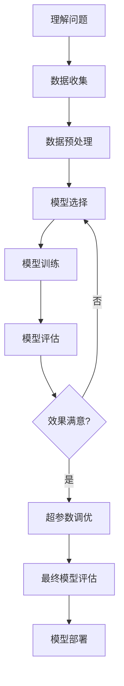

# 机器学习核心：零基础入门指南

## 什么是机器学习？
想象一下，你在教孩子区分猫和狗：不是直接告诉他规则，而是给他看各种猫狗图片，让他自己总结特征。  
**这就是机器学习！让计算机通过大量数据自己发现规律。**

# 机器学习工作流程总结

**记住：机器学习不是魔法！好的模型 = 70%数据质量 + 20%特征工程 + 10%模型选择与调优**   

开始你的机器学习之旅吧！实践是最好的学习方法，尝试解决Kaggle上的入门竞赛来积累经验。
