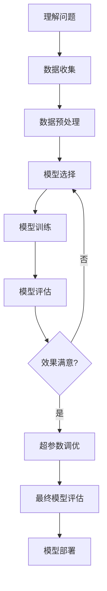

# 机器学习工作流程总结

```mermaid
%% 链表/树/图 - 使用Mermaid绘制
graph TD
    A[理解问题] --> B[数据收集]
    B --> C[数据预处理]
    C --> D[模型选择]
    D --> E[模型训练]
    E --> F[模型评估]
    F --> G{效果满意?}
    G -->|否| D
    G -->|是| H[超参数调优]
    H --> I[最终模型评估]
    I --> J[模型部署]
```
