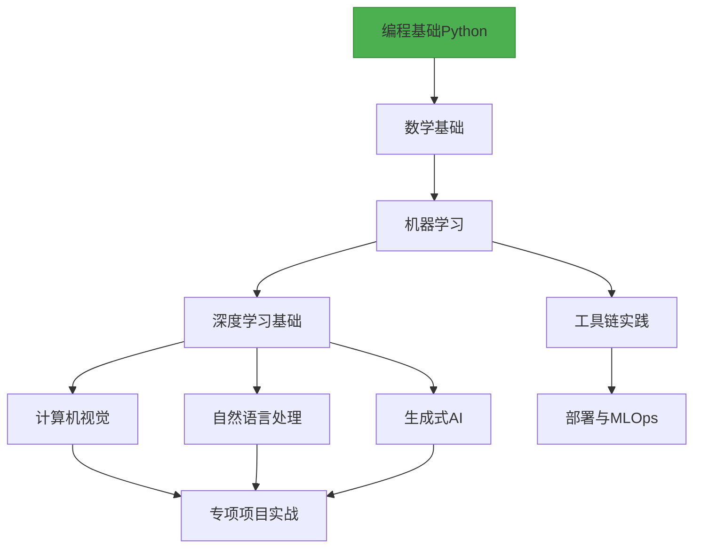

# 🚀🚀🚀 AI Learning Hub · 从零开始的AI学习旅程指南

> **掌握 AI，从这里开始**  
> 为所有对 AI 知识感兴趣的学习者打造的 AI / ML / DL 系统学习路线，涵盖优质课程、经典书籍、融合顶级资源、代码实战与开源工具，为你打造从入门到实战再到前沿研究的 AI 成长之路。  
>> **结构化 | 持续更新 | 最新学习 |社区共建** [](https://github.com/0voice/learning-Journey-AI)

---

🎯 **适合对象**：  
- 想从零起步学习 AI 的开发者  
- 需要一条系统、可落地的学习路径的学习者  
- 关注行业一线进展，想掌握前沿技术的人

🌟 **你将获得**：  
✅ 清晰的阶段性学习路线图  
✅ 精选高质量学习资源与工具  
✅ 覆盖从基础到进阶的实战项目  
✅ 定期更新，聚焦主流与前沿  
✅ 欢迎开源社区共同建设

> 💡**不再信息过载，不再无从下手，从这里开始系统掌握 AI。**

---

## ✈️ 学习路线图 Overview



## 📚 学习路径分阶段

### 📌 阶段 0：[前置知识](https://github.com/0voice/learning-Journey-AI/tree/main/Python%20and%20Math)
- **编程基础**  
  Python · 数据结构 · 算法 · Git/GitHub
- **数学基础**  
  线性代数 · 概率统计 · 微积分 · 优化理论

### 🎯 阶段 1：[机器学习](https://github.com/0voice/learning-Journey-AI/tree/main/Machine%20Learning)
- **监督学习**  
  线性/逻辑回归 · SVM · 决策树 · 集成方法
- **无监督学习**  
  聚类(K-means, DBSCAN) · 降维(PCA, t-SNE)
- **模型评估与优化**  
  交叉验证 · 超参数调优 · 评估指标

**📘 推荐资源：**
- [Andrew Ng 机器学习课程](https://www.coursera.org/learn/machine-learning)
- [📖 《机器学习》 - 周志华](https://book.douban.com/subject/26708119/)

### 🔥 阶段 2：[深度学习](https://github.com/0voice/learning-Journey-AI/tree/main/Deep%20learning)

| 方向         | 核心技术                        | 学习资源                             |
|--------------|---------------------------------|--------------------------------------|
| 基础理论     | 神经网络·反向传播·正则化        | [深度学习](https://www.deeplearningbook.org/) |
| 计算机视觉   | CNN·目标检测·图像分割           | [CS231n](http://cs231n.stanford.edu/)         |
| NLP          | RNN、Transformer、BERT、LLMs          | [NLP课程](https://course.fast.ai/)  |
| 生成模型     | GAN、Diffusion、ChatGPT              | [Hugging Face](https://huggingface.co/)       |

### 🎯 阶段 3：[工具与实践](https://github.com/0voice/learning-Journey-AI/tree/main/tools)
- **框架掌握**  
  PyTorch · TensorFlow · JAX
- **数据处理**  
  Pandas · NumPy · OpenCV · NLTK
- **模型部署**  
  ONNX · TensorRT · Flask/Django
- **MLOps基础**  
  MLflow · Weights & Biases · Docker


## 🔍 快速入口

| 我是...  | 快速入口                                                         |
| ------ | ------------------------------------------------------------ |
| 初学者    | [📘 Python 快速入门](https://github.com/0voice/learning-Journey-AI/tree/main/Python%20and%20Math) |
| 有基础者   | [📘 机器学习核心概念](https://github.com/0voice/learning-Journey-AI/tree/main/Machine%20Learning)                 |
| 想直接做项目 | [🔧 实战项目集](https://github.com/pytorch/examples)                         |
| 研究爱好者  | [📘 论文精读指南](https://github.com/terryum/awesome-deep-learning-papers)           |

## 🚧 实战项目示例
### CNN图像分类示例 - PyTorch

```python
# CNN图像分类示例 - PyTorch
import torch
import torchvision
import torch.nn as nn
import torch.optim as optim
from torchvision import transforms, datasets
```

### 1. 加载数据集
```python
transform = transforms.Compose([
    transforms.ToTensor(),
    transforms.Normalize((0.5, 0.5, 0.5), (0.5, 0.5, 0.5))
])
train_set = datasets.CIFAR10(root='./data', train=True, download=True, transform=transform)
train_loader = torch.utils.data.DataLoader(train_set, batch_size=64, shuffle=True)
```

### 2. 构建CNN模型
```python
class CNNClassifier(nn.Module):
    def __init__(self):
        super(CNNClassifier, self).__init__()
        self.conv1 = nn.Conv2d(3, 32, kernel_size=3, padding=1)
        self.relu1 = nn.ReLU()
        self.pool1 = nn.MaxPool2d(2)
        self.conv2 = nn.Conv2d(32, 64, kernel_size=3, padding=1)
        self.relu2 = nn.ReLU()
        self.pool2 = nn.MaxPool2d(2)
        self.flatten = nn.Flatten()
        self.fc1 = nn.Linear(64 * 8 * 8, 512)
        self.relu3 = nn.ReLU()
        self.fc2 = nn.Linear(512, 10)

    def forward(self, x):
        x = self.pool1(self.relu1(self.conv1(x)))
        x = self.pool2(self.relu2(self.conv2(x)))
        x = self.flatten(x)
        x = self.relu3(self.fc1(x))
        x = self.fc2(x)
        return x

model = CNNClassifier()
```

### 3. 训练模型
```python
criterion = nn.CrossEntropyLoss()
optimizer = optim.Adam(model.parameters(), lr=0.001)

for epoch in range(10):
    running_loss = 0.0
    for i, (images, labels) in enumerate(train_loader, 0):
        optimizer.zero_grad()
        outputs = model(images)
        loss = criterion(outputs, labels)
        loss.backward()
        optimizer.step()
        
        running_loss += loss.item()
        
    print(f'Epoch {epoch+1}, Loss: {running_loss/len(train_loader):.4f}')

print('训练完成!')
```

### 🔍 更多完整项目：

- [图像分类实战](https://github.com/0voice/learning-Journey-AI/blob/main/Project/%E5%9B%BE%E5%83%8F%E5%88%86%E7%B1%BB%E5%AE%9E%E6%88%98.md)
- [文本情感分析](https://github.com/0voice/learning-Journey-AI/blob/main/Project/%E6%96%87%E6%9C%AC%E6%83%85%E6%84%9F%E5%88%86%E6%9E%90.md)
- [聊天机器人构建](https://github.com/0voice/learning-Journey-AI/blob/main/Project/%E8%81%8A%E5%A4%A9%E6%9C%BA%E5%99%A8%E4%BA%BA%E6%9E%84%E5%BB%BA.md)


## 📚 核心资源总览
### 🎥在线课程推荐
- [Machine Learning - Andrew Ng (Coursera)](https://www.coursera.org/learn/machine-learning)

- [Deep Learning Specialization - deeplearning.ai](https://www.deeplearning.ai/program/deep-learning-specialization/)

- [Fast.ai Practical DL](https://course.fast.ai/)

### 📖电子书籍精选
- [《深度学习》 - Ian Goodfellow](https://www.deeplearningbook.org/)

- [《动手学深度学习》 - 李沐](https://zh.d2l.ai/)

- [《强化学习导论》 - Sutton & Barto](http://incompleteideas.net/book/the-book-2nd.html)

- [《统计学习方法》 - 李航](https://github.com/SmirkCao/Lihang)

### 📰经典论文
- [Attention is All You Need](https://arxiv.org/abs/1706.03762)

- [ResNet (Deep Residual Learning)](https://arxiv.org/abs/1512.03385)

- [BERT: Pre-training of Deep Bidirectional Transformers](https://arxiv.org/abs/1810.04805)

### 🧰开发工具
- [Google Colab](https://colab.research.google.com/)

- [VS Code](https://code.visualstudio.com/)

- [Hugging Face Transformers](https://github.com/huggingface/transformers)

## 💖 致谢
- 开源社区提供的优秀工具

- 教育先驱：社会各界AI学者，吴恩达教授等教育先驱

- 您！每一位使用和传播资料的学习者

> “人工智能如同新时代的电力，将重塑所有行业。”
> — Andrew Ng
