# 🚀🚀🚀 AI Learning Hub · 2025 最强 AI 学习路线，从入门到实战，全流程自学指南

<p align="center">
  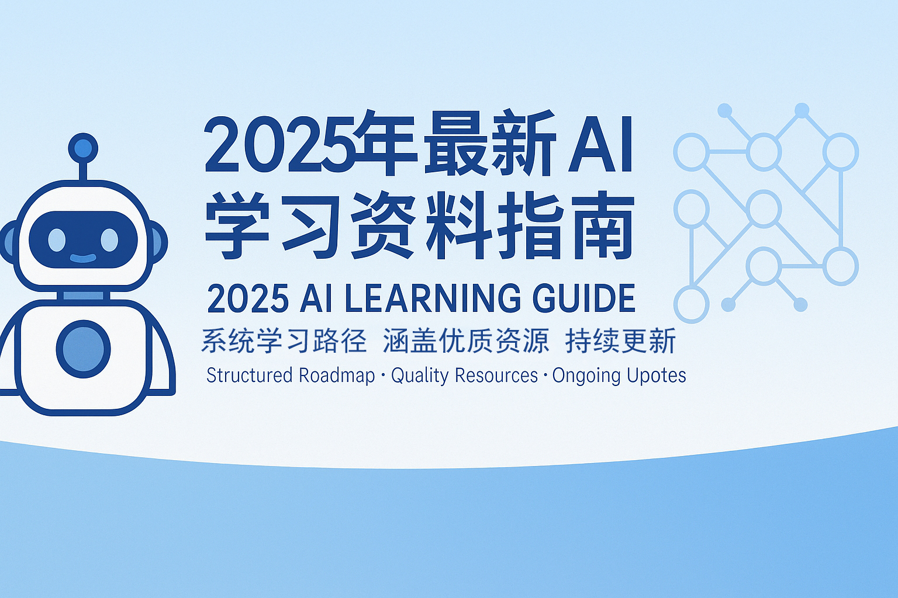
</p>

---

> **掌握 AI，从这里开始**  
> 为所有对 AI 知识感兴趣的学习者打造的 AI / ML / DL 系统学习路线，涵盖优质课程、经典书籍、融合顶级资源、代码实战与开源工具，为你打造从入门到实战再到前沿研究的 AI 成长之路。  
>> **结构化 | 持续更新 | 最新学习 |社区共建** [](https://github.com/0voice/learning-Journey-AI)

---

**🎯 适合对象**：  
- 想从零起步学习 AI 的开发者  
- 需要一条系统、可落地的学习路径的学习者  
- 关注行业一线进展，想掌握前沿技术的人

🌟 **你将获得**：  
✅ 清晰的阶段性学习路线图  
✅ 精选高质量学习资源与工具  
✅ 覆盖从基础到进阶的实战项目  
✅ 定期更新，聚焦主流与前沿  
✅ 欢迎开源社区共同建设


**🔍 快速入口**

| 我是...  | 快速入口                                                         |
| ------ | ------------------------------------------------------------ |
| 初学者    | [📘 Python 快速入门](https://github.com/0voice/learning-Journey-AI/tree/main/Python%20and%20Math) |
| 有基础者   | [📘 机器学习核心概念](https://github.com/0voice/learning-Journey-AI/tree/main/Machine%20Learning)                 |
| 想直接做项目 | [🔧 实战项目集](https://github.com/pytorch/examples)                         |
| 研究爱好者  | [📘 论文精读指南](https://github.com/terryum/awesome-deep-learning-papers)           |


**✈️ 学习路线图 Overview**

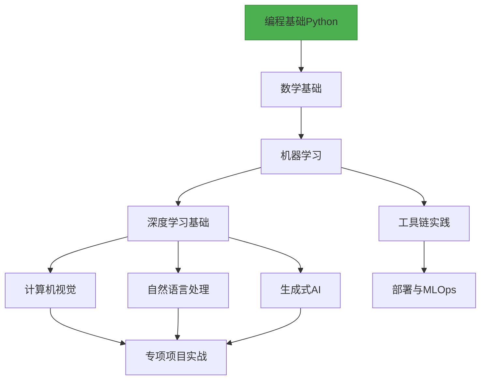

# ***📚 学习路径分阶段***
* [阶段 0：前置知识](#1)

* [阶段 1：机器学习](#2)

* [阶段 2：深度学习](#3)  

* [阶段 3：工具与实践](#4)

> 💡**不再信息过载，不再无从下手，从这里开始系统掌握 AI。**

---

# **<h3 id="1">[🎯 阶段 0：前置知识 数学基础](Python%20and%20Math)</h3>**
## [Python入门基础：零基础小白学习指南](Python%20and%20Math/python.md)


### 1.变量与数据类型
变量就像生活中的“标签”，给数据起名字方便使用：
```python
# 创建变量
name = "小明"        # 字符串 (文字)
age = 20             # 整数 (数字)
height = 1.75        # 浮点数 (带小数点的数字)
is_student = True    # 布尔值 (真/假)

print(name)          # 输出: 小明
print(age + 5)       # 输出: 25
```

### 2.控制结构：条件判断
如果...那么...否则...的逻辑：
```python
# 条件判断示例
temperature = 28

if temperature > 30:
    print("太热了！开空调")
elif temperature > 20:
    print("天气真舒服")
else:
    print("有点冷，多穿点")
```

### 3.控制结构：循环
重复执行某些操作：
```python
# for循环示例 - 遍历序列
fruits = ["苹果", "香蕉", "橙子"]

for fruit in fruits:
    print(f"我爱吃{fruit}")

# while循环示例 - 达到条件前重复
count = 0
while count < 5:
    print(f"这是第{count+1}次说你好")
    count += 1
```

### 4. 函数定义与调用
把常用操作打包成"工具"：
```python
# 定义函数：计算圆的面积
def circle_area(radius):
    area = 3.14 * radius * radius
    return area

# 使用函数
print(circle_area(5))  # 计算半径为5的圆面积
```
### 5. 类与面向对象编程
创建自定义的数据类型：
```python
# 定义"汽车"类
class Car:
    # 初始化方法(给新车设置属性)
    def __init__(self, brand, color):
        self.brand = brand
        self.color = color
    
    # 类的方法(行为)
    def drive(self):
        print(f"{self.color}色的{self.brand}正在行驶")

# 使用类创建对象
my_car = Car("特斯拉", "黑")
my_car.drive()  # 输出: 黑色的特斯拉正在行驶
```

### 6. 异常处理
防止程序出错时崩溃：
```python
# 尝试打开一个不存在的文件
try:
    file = open("不存在的文件.txt", "r")
except FileNotFoundError:
    print("找不到文件！请检查文件名")
```

## 数据结构基础

### 1.列表/元组/字典/集合

| 类型   | 特点                 | 示例                                 |
|--------|----------------------|--------------------------------------|
| 列表   | 可修改的有序集合     | `fruits = ["苹果", "香蕉", "橙子"]`  |
| 元组   | 不可修改的有序集合   | `point = (3, 5)`                     |
| 字典   | 键值对集合           | `student = {"姓名": "小明", "年龄": 20}` |
| 集合   | 无重复元素的无序集   | `unique_numbers = {1, 2, 3, 2} → {1, 2, 3}` |

```python
# 综合示例
# 购物清单（列表）
shopping_list = ["牛奶", "鸡蛋", "面包"]

# 商品价格（字典）
prices = {
    "牛奶": 15.5,
    "鸡蛋": 12.8,
    "面包": 8.0
}

# 计算总价
total = 0
for item in shopping_list:
    if item in prices:
        total += prices[item]

print(f"购物总价: {total}元")  # 输出: 购物总价: 36.3元
```

### 2.栈与队列
两种数据操作方式：
- ​​栈（Stack）​​：后进先出（LIFO），像叠盘子
```python
# 使用列表实现栈
stack = []
stack.append("第1盘")  # 放入
stack.append("第2盘")
top = stack.pop()      # 取出: "第2盘"
```
- ​​队列（Queue）​​：先进先出（FIFO），像排队
```python
# 使用队列
from collections import deque
queue = deque()
queue.append("第1人")  # 排队
queue.append("第2人")
first = queue.popleft()  # 服务: "第1人"
```

### 3. 链表/树/图
常用数据结构可视化比较：

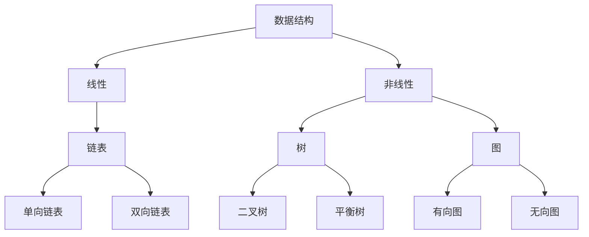

实际应用：
- ​​链表​​：浏览器历史记录
- 树​​：文件系统组织
- 图​​：社交网络关系

### 4. 时间/空间复杂度分析
评估算法效率的方法：
- 时间复杂度​​：算法运行时间随输入规模增长的变化
- 空间复杂度​​：算法运行所需内存空间的变化

常见时间复杂度：
- O(1) - 固定时间（最好）
- O(log n) - 对数时间（很好）
- O(n) - 线性时间（好）
- O(n²) - 平方时间（较差）

示例：查找列表中是否存在某元素
```python
# 简单查找 - O(n)
def simple_search(items, target):
    for item in items:
        if item == target:
            return True
    return False

# 二分查找（有序列表）- O(log n)
def binary_search(items, target):
    low, high = 0, len(items)-1
    while low <= high:
        mid = (low + high) // 2
        if items[mid] == target:
            return True
        elif items[mid] < target:
            low = mid + 1
        else:
            high = mid - 1
    return False
```

## 算法基础
### 1. 搜索算法
在数据集中查找特定元素：
| 方法       | 场景         | 优点         | 缺点               |
|------------|--------------|--------------|--------------------|
| 线性搜索   | 无序列表     | 简单直接     | 效率低(O(n))      |
| 二分搜索   | 有序列表     | 高效(O(log n)) | 要求列表有序       |

示例：二分查找实现
```python
def binary_search(items, target):
    # 起点和终点索引
    low, high = 0, len(items)-1
    
    while low <= high:
        # 计算中间位置
        mid = (low + high) // 2
        mid_value = items[mid]
        
        # 找到目标
        if mid_value == target:
            return mid
        
        # 目标在右侧
        elif mid_value < target:
            low = mid + 1
        
        # 目标在左侧
        else:
            high = mid - 1
    
    # 未找到
    return -1
```
### 2. 排序算法
重新排列元素顺序：
| 方法       | 平均复杂度       | 特点              |
|------------|------------------|-------------------|
| 冒泡排序   | \( O(n^2) \)     | 简单但慢          |
| 快速排序   | \( O(n \log n) \) | 高效，常用        |
| 归并排序   | \( O(n \log n) \) | 稳定，大数据处理  |

快速排序示例：
```python
def quicksort(arr):
    if len(arr) <= 1:
        return arr
    
    pivot = arr[len(arr) // 2]  # 选择中间值作为基准
    left = [x for x in arr if x < pivot]
    middle = [x for x in arr if x == pivot]
    right = [x for x in arr if x > pivot]
    
    return quicksort(left) + middle + quicksort(right)
```
### 3. 动态规划
把大问题分解成小问题，并存储小问题结果：
- 适合求解：斐波那契数列、最短路径等
- 核心思想：避免重复计算，使用缓存
斐波那契数列动态规划实现：
```python
def fib(n):
    # 存储计算结果
    cache = [0, 1]  
    
    # 从2开始计算并存储结果
    for i in range(2, n+1):
        cache.append(cache[i-1] + cache[i-2])
    
    return cache[n]

print(fib(10))  # 输出: 55
```
### 4. 贪心算法
每一步都选择当前最优解：
- 特点：简单高效，但不一定能得到全局最优
- 应用场景：零钱兑换、哈夫曼编码等
零钱兑换示例：
```python
def coin_change(coins, amount):
    # 排序硬币（从大到小）
    coins.sort(reverse=True)
    result = []
    
    # 尝试使用每个硬币
    for coin in coins:
        while amount >= coin:
            amount -= coin
            result.append(coin)
    
    return result

# 用最少硬币组成86分
coins = [1, 5, 10, 25]
print(coin_change(coins, 86))  # [25, 25, 25, 10, 1]
```

## Git/GitHub 版本控制
### 1. 版本控制基础
什么是版本控制？记录文件变化的历史记录系统
核心概念：
- 仓库（Repository）​​：项目的文件夹及其历史记录
- 提交（Commit）​​：一次版本保存（含描述信息）
- 分支（Branch）​​：隔离的实验空间
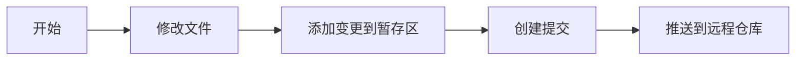

### 2. 分支管理
在不同分支上进行开发：
```bash
# 1. 创建新分支
git branch new-feature

# 2. 切换到该分支
git checkout new-feature

# 3. 在新分支上进行开发修改...
git add .
git commit -m "添加新功能"

# 4. 完成后合并到主分支
git checkout main
git merge new-feature

# 5. 推送到远程仓库
git push origin main
```
### 3. 合并请求工作流（Pull Request）
团队协作的标准流程：
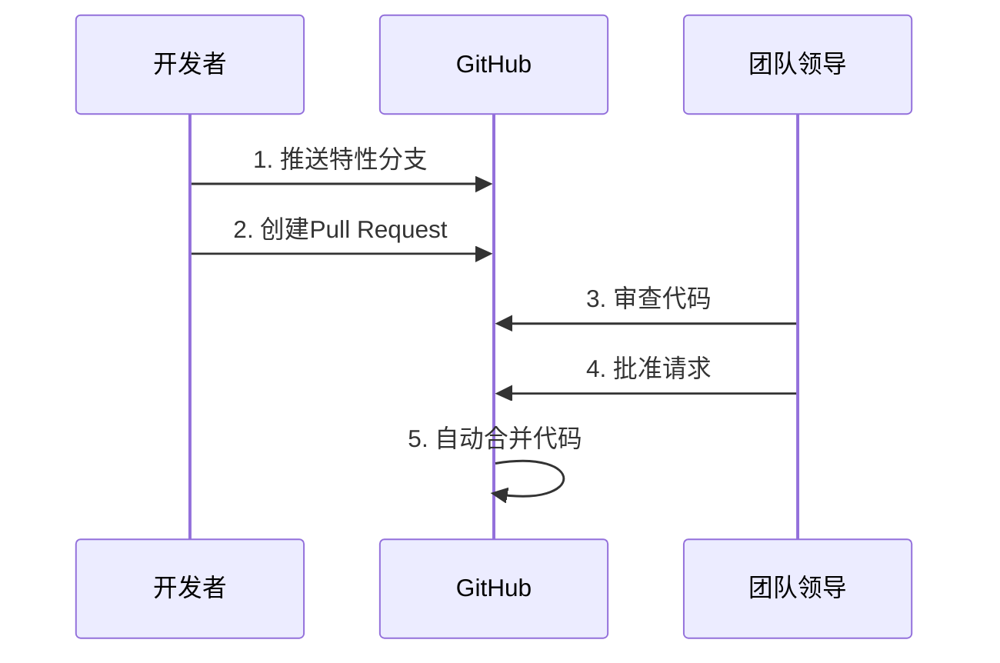
### 4. 代码协作最佳实践
1.​​每日提交​​：小步前进，多次提交  
2.​​清晰的提交信息​​：
```bash
# 差的信息: "修复问题"
# 好的信息: "修复登录页面验证码不显示的问题"
```
​​3.分支命名规范​​：
- feature/user-authentication（新功能）
- fix/button-alignment（修复问题）  

4.使用.gitignore文件排除不需要跟踪的文件  

5.定期git pull拉取他人更改，减少冲突

## [数学基础入门：小白也能懂的AI数学](Python-and-Math/math.md)

### 线性代数 - 数据的基本骨架
#### 1. 矩阵运算：数据的表格
矩阵就像Excel表格，用来组织数字：
```python
import numpy as np

# 创建2x2矩阵
matrix = np.array([[1, 2], 
                   [3, 4]])
                   
# 矩阵加法
matrix + 2  # 所有元素加2 → [[3,4],[5,6]]

# 矩阵乘法
np.dot(matrix, matrix)  # 矩阵自乘 → [[7,10],[15,22]]
```
#### 2. 向量空间：箭头指向的方向
向量就像带方向的箭头：
```python
# 在三维空间中的两个向量
vector_a = np.array([1, 2, 3])
vector_b = np.array([4, 5, 6])

# 向量的点积（投影）
dot_product = np.dot(vector_a, vector_b)  # 1×4 + 2×5 + 3×6 = 32

# 向量长度
length_a = np.linalg.norm(vector_a)  # √(1²+2²+3²) ≈ 3.74
```
#### 3. 特征值/特征向量：矩阵的本质
当矩阵作用在特定向量上时不改变方向：
```python
# 求矩阵的特征值和特征向量
matrix = np.array([[2, 1],
                   [1, 2]])
                   
eigenvalues, eigenvectors = np.linalg.eig(matrix)

print("特征值:", eigenvalues)    # [3., 1.]
print("特征向量:\n", eigenvectors)  # [[ 0.707, -0.707], [0.707, 0.707]]
```
#### 4. 奇异值分解(SVD)：数据的本质拆分
将任意矩阵分解为三个特殊矩阵相乘：
```python
# 图像压缩示例（实际应用中）
from skimage import data
from skimage.transform import resize
import matplotlib.pyplot as plt

# 加载小图像
image = resize(data.astronaut(), (100, 100))
gray_image = np.mean(image, axis=2)

# 进行奇异值分解
U, s, VT = np.linalg.svd(gray_image, full_matrices=False)

# 仅保留前20个特征重建图像
k = 20
reconstructed = U[:, :k] @ np.diag(s[:k]) @ VT[:k, :]

# 显示压缩前后对比
fig, (ax1, ax2) = plt.subplots(1, 2)
ax1.imshow(gray_image, cmap='gray')
ax1.set_title('原始图像')
ax2.imshow(reconstructed, cmap='gray')
ax2.set_title('压缩后图像 (SVD)')
plt.show()
```
### 概率统计 - 预测与不确定性的艺术
#### 1. 概率分布：事件发生的可能性
```python
import matplotlib.pyplot as plt
import numpy as np
from scipy.stats import norm, binom, poisson

# 正态分布（高斯分布）
x = np.linspace(-5, 5, 100)
plt.plot(x, norm.pdf(x, 0, 1), label='正态分布')

# 二项分布（抛硬币）
n, p = 10, 0.5
x_binom = np.arange(0, 11)
plt.stem(x_binom, binom.pmf(x_binom, n, p), 'bo', label='二项分布')

# 泊松分布（罕见事件）
lambda_ = 3
x_poisson = np.arange(0, 10)
plt.stem(x_poisson, poisson.pmf(x_poisson, lambda_), 'g^', label='泊松分布')

plt.legend()
plt.title('常见概率分布')
plt.xlabel('数值')
plt.ylabel('概率密度')
plt.show()
```
#### 2. 贝叶斯定理：新证据更新信念
**医生诊断疾病的情景：​**
- 假设：
+ 疾病D患病率: 1% → P(D) = 0.01
+ 检测灵敏度: 99% → P(阳性|D) = 0.99
+ 检测特异度: 95% → P(阴性|健康) = 0.95
求P(确实有病|检测阳性)?
```python
# 计算贝叶斯概率
p_disease = 0.01      # P(D)
p_positive_given_disease = 0.99  # P(阳性|D)
p_negative_given_healthy = 0.95  # P(阴性|健康)

# P(阳性|健康) = 1 - P(阴性|健康)
p_positive_given_healthy = 1 - p_negative_given_healthy

# P(阳性) = P(阳性|D) * P(D) + P(阳性|健康) * P(健康)
p_positive = (p_positive_given_disease * p_disease) + (p_positive_given_healthy * (1-p_disease))

# P(D|阳性) = [P(阳性|D) * P(D)] / P(阳性)
p_disease_given_positive = (p_positive_given_disease * p_disease) / p_positive

print(f"检测阳性后真正患病的概率: {p_disease_given_positive*100:.2f}%")  # ≈16.2%
```
#### 3. 假设检验：判断差异是否真实
**​​学生A和B谁成绩更好**​​
+ A班平均分：78分（30人）
+ B班平均分：82分（30人）
+ 差异显著吗？
```python
from scipy import stats

# 生成模拟数据（方差为10）
np.random.seed(42)
class_a = np.random.normal(78, 10, 30)
class_b = np.random.normal(82, 10, 30)

# 进行t检验
t_stat, p_value = stats.ttest_ind(class_a, class_b)

alpha = 0.05  # 显著性水平
if p_value < alpha:
    print(f"p值 = {p_value:.4f} < 0.05，两组有显著差异")
else:
    print(f"p值 = {p_value:.4f} >= 0.05，两组无显著差异")
```
#### 4. 回归分析：预测趋势
根据房屋面积预测价格：
```python
from sklearn.linear_model import LinearRegression

# 样本数据（面积 vs 价格）
areas = np.array([50, 70, 90, 110, 130]).reshape(-1, 1)  # m²
prices = np.array([200, 240, 290, 340, 380])  # 万元

# 创建模型并拟合
model = LinearRegression()
model.fit(areas, prices)

# 预测80平米房子的价格
prediction = model.predict([[80]])
print(f"预测80平米房屋价格：{prediction[0]:.1f}万元")

# 绘制数据点及拟合线
plt.scatter(areas, prices, label='实际价格')
plt.plot(areas, model.predict(areas), 'r-', label='预测趋势')
plt.scatter([80], prediction, c='g', marker='*', s=200, label='预测点')
plt.xlabel('面积(m²)')
plt.ylabel('价格(万元)')
plt.legend()
plt.show()
```
### 微积分 - 变化的数学语言
#### 1. 导数与积分：变化与累积  
> **​​导数 ≈ 瞬时速度，积分 ≈ 总距离​**
```python
# 某车辆的运动函数：位置 = 时间²
t = np.linspace(0, 5, 100)  # 0到5秒
position = t**2              # 位置函数

# 计算导数（速度）
# 导数的数值计算：dy/dx ≈ Δy/Δx
velocity = np.gradient(position, t)  # 2t

# 计算积分（总路程）
# 积分的数值计算（累加）
distance = np.cumsum(velocity * np.diff(t, prepend=0))

# 绘制结果
plt.figure(figsize=(10, 6))
plt.subplot(211)
plt.plot(t, position, 'b-', label='位置')
plt.plot(t, velocity, 'g--', label='速度(导数)')
plt.legend()
plt.title('位置与速度关系')

plt.subplot(212)
plt.plot(t, distance, 'r-', label='路程(积分)')
plt.legend()
plt.xlabel('时间(秒)')
plt.show()
```
#### 2. 偏导数：多维空间的变化率
温度场的变化（随时间+位置）：
```python
from mpl_toolkits.mplot3d import Axes3D

# 创建时间和空间的网格
x = np.linspace(0, 10, 100)  # 空间坐标
t = np.linspace(0, 5, 100)    # 时间坐标
X, T = np.meshgrid(x, t)

# 温度函数：温度 = e^{-0.1t} * sin(x)
Z = np.exp(-0.1*T) * np.sin(X)

# 绘制3D温度场
fig = plt.figure(figsize=(10, 7))
ax = fig.add_subplot(111, projection='3d')
ax.plot_surface(X, T, Z, cmap='viridis')
ax.set_xlabel('位置(x)')
ax.set_ylabel('时间(t)')
ax.set_zlabel('温度(℃)')
ax.set_title('空间温度分布随时间变化')
plt.show()
```
#### 3. 梯度：最陡的上山方向
```python
# 定义一个山峰形状的函数
def mountain(x, y):
    return np.exp(-0.1*(x**2 + y**2)) * np.cos(0.5*x)

# 创建网格
x = np.linspace(-3, 3, 100)
y = np.linspace(-3, 3, 100)
X, Y = np.meshgrid(x, y)
Z = mountain(X, Y)

# 计算梯度（下山方向）
gy, gx = np.gradient(Z)
skip = 5  # 显示部分箭头

# 绘制等高线图
plt.figure(figsize=(10, 8))
plt.contourf(X, Y, Z, 20, cmap='viridis')
plt.colorbar()
plt.quiver(X[::skip, ::skip], Y[::skip, ::skip], 
           -gx[::skip, ::skip], -gy[::skip, ::skip], 
           scale=50, color='white')  # 负梯度表示最陡下降方向
plt.title('地形梯度图 - 白色箭头指向最陡下降方向')
plt.xlabel('X')
plt.ylabel('Y')
plt.show()
```
#### 4. 泰勒级数：用多项式逼近复杂函数
用多项式逼近正弦函数：
```python
# 正弦函数及其泰勒展开
x = np.linspace(-10, 10, 500)
sin_x = np.sin(x)

# 不同阶数的泰勒展开
taylor1 = x  # 1阶
taylor3 = x - x**3/6  # 3阶
taylor5 = taylor3 + x**5/120  # 5阶

# 绘制比较图
plt.figure(figsize=(10, 6))
plt.plot(x, sin_x, 'b-', lw=3, label='真实 sin(x)')
plt.plot(x, taylor1, 'g--', label='1阶展开')
plt.plot(x, taylor3, 'r-.', label='3阶展开')
plt.plot(x, taylor5, 'm:', lw=2, label='5阶展开')
plt.ylim(-3, 3)
plt.legend()
plt.title('泰勒级数逼近正弦函数')
plt.xlabel('x')
plt.ylabel('f(x)')
plt.grid(True)
plt.show()
```
### 优化理论 - 寻找最佳解决方案
#### 1. 梯度下降：一步一步找到最低点
**寻找函数最低点：**
```python
# 定义函数：f(x) = x^4 - 3x^3 + 2
def f(x):
    return x**4 - 3*x**3 + 2

# 导数：f'(x) = 4x^3 - 9x^2
def df(x):
    return 4*x**3 - 9*x**2

# 梯度下降
x = 2.0     # 初始点
lr = 0.01   # 学习率
steps = 50  # 迭代次数

# 记录路径
path = [x]

for i in range(steps):
    grad = df(x)
    x = x - lr * grad  # 向下走一步
    path.append(x)
    
# 绘制函数及下降路径
x_vals = np.linspace(-1, 3, 200)
plt.plot(x_vals, f(x_vals), 'b-', lw=2, label='f(x)')
plt.scatter(path, f(np.array(path)), c='r', marker='o')
for i in range(1, len(path)):
    plt.annotate('', xy=(path[i], f(path[i])), 
                xytext=(path[i-1], f(path[i-1])),
                arrowprops=dict(arrowstyle='->', color='r'))
plt.xlabel('x')
plt.ylabel('f(x)')
plt.title('梯度下降过程')
plt.grid(True)
plt.show()
```
#### 2. 约束优化：带限制的最优化问题
```python
from scipy.optimize import minimize

# 目标函数：f(x,y) = (x-1)² + (y-2.5)²
objective = lambda x: (x[0]-1)**2 + (x[1]-2.5)**2

# 约束条件：
# x - 2y >= -1    → 约束1
# -x - 2y >= -6   → 约束2
# -x + 2y >= -2   → 约束3
constraints = [
    {'type': 'ineq', 'fun': lambda x: x[0] - 2*x[1] + 1},  # ≥0
    {'type': 'ineq', 'fun': lambda x: -x[0] - 2*x[1] + 6},
    {'type': 'ineq', 'fun': lambda x: -x[0] + 2*x[1] + 2}
]

# 初始猜测
x0 = [0, 0]

# 求解
solution = minimize(objective, x0, constraints=constraints)
print(f"最小值点: ({solution.x[0]:.2f}, {solution.x[1]:.2f})")
print(f"最小值: {solution.fun:.4f}")
```
#### 3. 凸优化基础：不会陷入局部最优的特例
```
graph LR
    A[优化问题] --> B{是否为凸？}
    B -- 是 --> C[只有一个全局最优解]
    B -- 否 --> D[可能有多个局部最优解]
    
    subgraph 凸函数特性
    C --> E[二阶导数>=0]
    C --> F[任意连线位于函数上方]
    C --> G[局部最优即全局最优]
    end
```
凸优化的黄金定律：
1. 凸问题总能找到全局最优解  
2. 机器学习中常将非凸问题转化为凸问题求解

#### 4. 学习率策略：智能调整学习步伐
不同学习率策略对比：
```python
# 三种学习率策略
def constant_lr(epoch):  # 固定学习率
    return 0.1

def step_lr(epoch):     # 阶梯下降
    if epoch < 10:
        return 0.1
    elif epoch < 20:
        return 0.01
    else:
        return 0.001

def exp_lr(epoch):      # 指数衰减
    return 0.1 * (0.9 ** epoch)

# 绘制学习率变化曲线
epochs = range(1, 31)

plt.plot(epochs, [constant_lr(e) for e in epochs], 'b-o', label='固定学习率')
plt.plot(epochs, [step_lr(e) for e in epochs], 'r-s', label='阶梯衰减')
plt.plot(epochs, [exp_lr(e) for e in epochs], 'g-^', label='指数衰减')
plt.xlabel('训练轮次(epoch)')
plt.ylabel('学习率')
plt.title('不同学习率策略比较')
plt.legend()
plt.grid(True)
plt.show()
```
### 数学在AI中的实际应用
**典型AI任务中涉及的数学：**
| AI模型       | 线性代数 | 概率统计 | 微积分 | 优化方法 |
|--------------|----------|----------|--------|----------|
| 线性回归     | ★★       | ★★       | ★      | ★★       |
| 神经网络     | ★★★      | ★        | ★★★    | ★★★      |
| 推荐系统     | ★★       | ★★★      | ★      | ★★       |
| 图像处理     | ★★★      | ★        | ★      | ★★       |
| 强化学习     | ★        | ★★★      | ★★     | ★★★      |
**学习建议：**
​​1. 理解 > 记忆​​：先搞懂概念，公式自然记住  
​​2. 可视化是利器​​：多画图帮助理解抽象概念  
3. ​​动手计算​​：Python工具包是数学学习好帮手  
4. ​​实际应用驱动​​：关注知识在AI中的具体用途  

> 通过这份教程，您已经初步掌握了AI所需的数学基础。
>> 数学就像编程的"内功"，需要**持续练习**才能真正理解其精髓！

---

# **<h3 id="2">[🎯 阶段 1：机器学习：零基础入门指南](https://github.com/0voice/learning-Journey-AI/tree/main/Machine%20Learning)</h3>**


> ***什么是机器学习？*** 想象一下，你在教孩子区分猫和狗：不是直接告诉他规则，而是给他看各种猫狗图片，让他自己总结特征。
>> **这就是机器学习！让计算机通过大量数据自己发现规律。**
  
**机器学习工作流程总结**
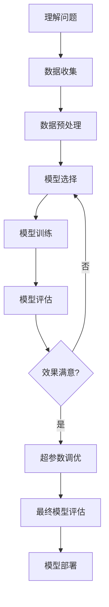

**接下来我们从以下几个点开始讲解**  

- **监督学习**  
  线性/逻辑回归 · SVM · 决策树 · 集成方法
- **无监督学习**  
  聚类(K-means, DBSCAN) · 降维(PCA, t-SNE)
- **模型评估与优化**  
  交叉验证 · 超参数调优 · 评估指标

  
## 监督学习：有老师的指导学习
### 1. 线性回归：预测连续值
- ​​核心思想​​：找到一条最佳拟合线，预测连续值结果
- 实例应用​​：根据房子面积预测房价
```python
# 简单线性回归示例
import numpy as np
from sklearn.linear_model import LinearRegression

# 房子面积数据（平方米）
house_sizes = np.array([50, 70, 90, 110]).reshape(-1, 1)
# 对应房价（万元）
prices = np.array([300, 400, 500, 600])

# 创建模型并训练
model = LinearRegression()
model.fit(house_sizes, prices)

# 预测120平房子的价格
prediction = model.predict([[120]])
print(f"预测房价: {prediction[0]:.1f}万元")  # 输出: 预测房价: 700.0万元
```

### 2. 逻辑回归：解决二分类问题  

- ​​核心思想​​：计算某件事发生的概率（0-1之间）  
- ​​实例应用​​：判断邮件是否为垃圾邮件
```python
# 垃圾邮件识别示例
from sklearn.linear_model import LogisticRegression

# 假设有以下特征：
# feature1: 邮件包含"免费"次数
# feature2: 邮件包含"获奖"次数
X_train = [[3, 1], [5, 2], [1, 0], [0, 1]]  # 训练数据
y_train = [1, 1, 0, 0]  # 1=垃圾邮件，0=正常邮件

# 创建模型并训练
spam_detector = LogisticRegression()
spam_detector.fit(X_train, y_train)

# 预测新邮件
new_email = [[4, 3]]  # 包含4次"免费"，3次"获奖"
prediction = spam_detector.predict(new_email)
print("垃圾邮件" if prediction[0] == 1 else "正常邮件")  # 输出: 垃圾邮件
```

### 3. 支持向量机(SVM)：找最佳决策边界  
- 核心思想​​：在数据点之间找到最宽的"隔离带"​​
- 实例应用​​：手写数字识别  
 基础概念图示：
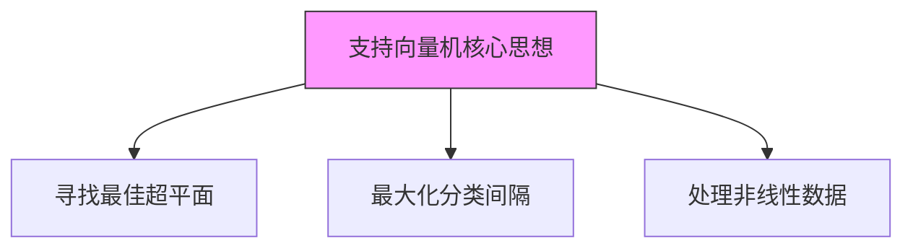

### 4. 决策树：树状决策模型
- ​​工作原理​​：像"20个问题"游戏，通过一系列问题得出结论
​​- 实例应用​​：贷款审批决策
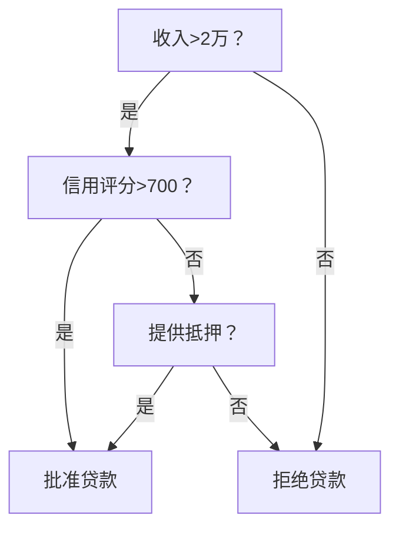

### 5. 集成方法：团结力量大
三种常用方法：
| 方法         | 工作原理                     | 优点                  |
|--------------|----------------------------|-----------------------|
| 随机森林     | 多棵树共同投票               | 抗过拟合能力强        |
| 梯度提升树   | 后一棵树修正前一棵树的错误    | 预测精度高            |
| AdaBoost     | 重点训练难分类样本           | 处理不平衡数据        |

## 无监督学习：无人指导的自我发现
### 1. 聚类分析：物以类聚
**K-means聚类**  
- ​​工作原理​​：自动将数据分成K个簇
- ​​实例应用​​：市场细分分析
```python
# 客户分群示例
from sklearn.cluster import KMeans
import numpy as np

# 假设有两种客户特征：购买频率和平均客单价
customer_data = np.array([
    [1, 100],   # 客户1
    [5, 500],   # 客户2
    [1, 150],   # 客户3
    [6, 550]    # 客户4
])

# 创建K=2的聚类模型
kmeans = KMeans(n_clusters=2)
kmeans.fit(customer_data)

# 查看分群结果
print("客户分群结果:", kmeans.labels_)
# 可能输出: [0, 1, 0, 1] 表示分成两组
```
**K-means可视化过程：**
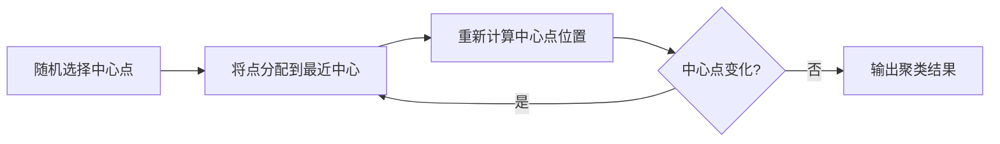
**DBSCAN聚类**
- ​​特点​​：自动发现任意形状的聚类簇
​​- 适用场景​​：地理数据聚类

### 2. 降维技术：化繁为简
**主成分分析(PCA)**  
- ​​工作原理​​：将高维数据压缩到关键维度
- ​​实例应用​​：人脸识别特征提取
```python
# PCA降维示例
from sklearn.decomposition import PCA
import numpy as np

# 创建一些三维数据
data = np.array([
    [1, 2, 3],
    [4, 5, 6],
    [7, 8, 9],
    [10, 11, 12]
])

# 创建PCA模型，降到二维
pca = PCA(n_components=2)
reduced_data = pca.fit_transform(data)

print("降维后数据:")
print(reduced_data)
```
**t-SNE技术**
-​​ 特点​​：保持相似点彼此接近
​​- 适用场景​​：高维数据可视化（如MNIST手写数字）

## 模型评估与优化
### 1. 评估指标：考卷评分
**回归问题指标:**
| 指标   | 公式                               | 特点                     |
|--------|-----------------------------------|--------------------------|
| MAE    | \( \frac{1}{n}\sum_{i=1}^{n} \|y_i - \hat{y_i}\| \) | 预测值与真实值的平均绝对误差 |
| MSE    | \( \frac{1}{n}\sum_{i=1}^{n}(y_i - \hat{y_i})^2 \) | 对大误差惩罚更大           |
| R²     | \( 1 - \frac{\sum_{i=1}^{n}(y_i - \hat{y_i})^2}{\sum_{i=1}^{n}(y_i - \bar{y})^2} \) | 表示模型解释力           |

**分类问题指标:**
| 指标     | 计算公式                                | 适用场景             |
|----------|----------------------------------------|----------------------|
| 准确率   | \( \frac{TP + TN}{TP + FP + FN + TN} \) | 均衡数据             |
| 精确率   | \( \frac{TP}{TP + FP} \)               | 注重预测质量         |
| 召回率   | \( \frac{TP}{TP + FN} \)               | 注重查全率           |
| F1分数   | \( 2 \times \frac{Precision \times Recall}{Precision + Recall} \) | 综合指标             |

### 2. 交叉验证：防止过拟合
**​​传统验证 vs K折交叉验证**
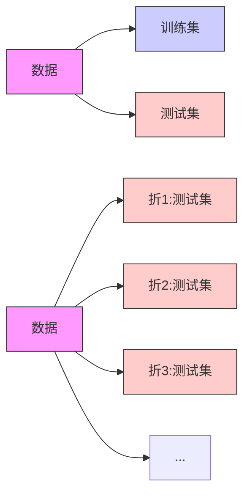
```python
# 交叉验证示例
from sklearn.model_selection import cross_val_score
from sklearn.ensemble import RandomForestClassifier

# 创建模型
model = RandomForestClassifier()

# 使用5折交叉验证
scores = cross_val_score(model, X, y, cv=5)

print(f"交叉验证得分: {scores}")
print(f"平均准确率: {scores.mean():.2f}")
```
### 3. 超参数调优：模型微调
​​**两种主要方法​​：**
1. **网格搜索**​​：尝试所有可能的参数组合
```python
from sklearn.model_selection import GridSearchCV

param_grid = {
    'n_estimators': [50, 100, 200],
    'max_depth': [3, 5, 7]
}

grid_search = GridSearchCV(RandomForestClassifier(), param_grid, cv=5)
grid_search.fit(X_train, y_train)

print("最佳参数组合:", grid_search.best_params_)
```
2. ​**随机搜索**​​：随机采样参数组合，更高效
```python
from sklearn.model_selection import RandomizedSearchCV

param_dist = {
    'n_estimators': range(50, 500, 50),
    'max_depth': range(3, 15)
}

random_search = RandomizedSearchCV(RandomForestClassifier(), 
                                 param_dist, 
                                 n_iter=20, 
                                 cv=5)
random_search.fit(X_train, y_train)
```

> **记住：机器学习不是魔法！好的模型 = 70%数据质量 + 20%特征工程 + 10%模型选择与调优**   
>> 开始你的机器学习之旅吧！实践是最好的学习方法，尝试解决Kaggle上的入门竞赛来积累经验。

## 📘 推荐资源：
- [Andrew Ng 机器学习课程](https://www.coursera.org/learn/machine-learning)
- [📖 《机器学习》 - 周志华](https://book.douban.com/subject/26708119/)
- [Kaggle](https://www.kaggle.com/)
- [UCI ML](https://archive.ics.uci.edu/)

---

# **<h3 id="3">[🔥 阶段 2：深度学习](https://github.com/0voice/learning-Journey-AI/tree/main/Deep%20learning)</h3>**

> ***深度学习入门指南 🚀*** 深度学习就像教婴儿认识世界​​：
>> **先认识形状（基础理论）**，**再认人脸（计算机视觉）**，  
>> **然后学说话（NLP）**，**最后学会创作（生成模型）**。

| 方向         | 核心技术                        | 学习资源                             |
|--------------|---------------------------------|--------------------------------------|
| 基础理论     | 神经网络·反向传播·正则化        | [深度学习](https://www.deeplearningbook.org/) |
| 计算机视觉   | CNN·目标检测·图像分割           | [CS231n](http://cs231n.stanford.edu/)         |
| NLP          | RNN、Transformer、BERT、LLMs          | [NLP课程](https://course.fast.ai/)  |
| 生成模型     | GAN、Diffusion、ChatGPT              | [Hugging Face](https://huggingface.co/)       |


## [神经网络超详细图解：小白的3D拆解指南 🧠](Deep%20learning/神经网络.md)
> 想象神经网络就像一套乐高积木工厂！输入是原料，输出是成品，隐藏层就是层层组装流水线。下面带你走进这个神奇工厂：

### 一、核心结构
#### 1. 核心三件套
- 像人脑神经元网络：输入层（眼睛看）→ 隐藏层（大脑思考）→ 输出层（嘴巴说）
- 可视化理解：
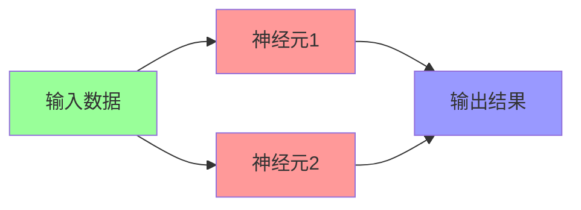

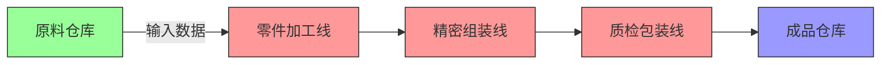
- 输入层​​ → 原料仓库（接收原始数据：如图像像素/文字编码）
- ​​隐藏层​​ → 组装车间（多层流水线处理特征）
- ​​输出层​​ → 成品仓库（生成结果：如"猫/狗"分类）

#### 2. 反向传播​​
- 学习过程：考试后老师批改试卷 → 告诉你哪里错了 → 下次改进
- 数学本质：从输出层倒推调整每个神经元的"重要性权重"  

#### 3. 正则化​​  
- 防"死记硬背"：给学生划重点（降低复杂度），避免考试换题就挂科（过拟合）
- 常用方法：Dropout（随机屏蔽神经元）、L1/L2（控制权重数值）

**📌 ​​真实案例​​：人脸识别系统**
- 输入层：接收128x128像素图片（=16,384个输入点）
- 隐藏层：层层提取眼睛/鼻子等特征
- 输出层：判断这是否是特定人物

### 二、神经元：工厂里的智能机器人
每个神经元都是微型计算单元：
```python
# 单个神经元的工作代码
def 神经元(输入信号, 权重, 偏置):
    weighted_sum = sum(输入信号 * 权重) + 偏置  # 加权求和
    return 激活函数(weighted_sum)           # 非线性转换
```
- 权重(weight)​​ → 工人经验值（老工人更关注关键特征）
- ​​偏置(bias)​​ → 质检标准（调整判断松紧度）
- ​​激活函数​​ → 核心！让机器具备"思考能力"的秘密武器

**常见激活函数对比：**
  
| 函数名称   | 工作方式               | 适用场景       | 形象比喻         |
|------------|-----------------------|---------------|------------------|
| Sigmoid    | 压缩到0-1区间         | 概率预测       | 温和的老师傅     |
| ReLU       | 负数归零，正数保留     | 90%现代网络    | 果断的质检员 ✅  |
| Tanh       | 压缩到-1到1区间       | RNN网络       | 严格的工程师     |

***🔥 为什么需要激活函数？***  
没有它 → 神经网络只是高级计算器（只能处理线性问题）  
加上它 → 神经网络变身万能近似器（可处理任意复杂问题）  

### 三、训练过程：工厂师徒教学系统
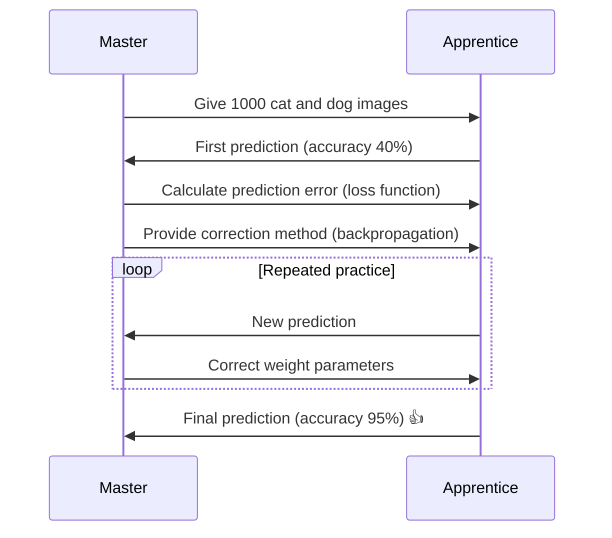

**关键训练组件**
#### 1. ​​损失函数​​ → 成绩单
- 分类任务：交叉熵（Cross-Entropy）

 损失 = -Σ(真实值 * log(预测值))
- 回归任务：均方误差（MSE）
  
 损失 = Σ(预测值 - 真实值)² / n
#### ​​2. 优化器​​ → 教学方法
- 基础版：梯度下降
  
 新权重 = 旧权重 - 学习率 × 梯度
- 智能版：Adam优化器（自动调节学习率）
#### 3. ​​反向传播​​ → 错题分析
- 从输出层开始逐层回溯
- 用链式法则计算各层权重需调整的程度

> ***💡 学习率小贴士：***  
> 太大 → 学徒浮躁乱改参数（震荡不收敛）  
> 太小 → 学徒进步缓慢（训练速度慢）  
> 理想值 → 0.001到0.1之间（需实验调整）  

### 四、实战演示：手写数字识别
**用Python+Keras搭建28x28像素识别网络：**
```python
from keras.models import Sequential
from keras.layers import Dense

# 搭建流水线
model = Sequential()
model.add(Dense(512, activation='relu', input_shape=(784,))) # 首层需指定输入尺寸
model.add(Dense(256, activation='relu'))     # 隐藏层2
model.add(Dense(128, activation='relu'))     # 隐藏层3
model.add(Dense(10, activation='softmax'))   # 输出层(10个数字概率)

# 配置生产线
model.compile(optimizer='adam',
              loss='sparse_categorical_crossentropy',
              metrics=['accuracy'])

# 开始训练(使用MNIST数据集)
model.fit(x_train, y_train, epochs=10)

# 测试效果
test_loss, test_acc = model.evaluate(x_test, y_test)
print(f"识别准确率: {test_acc*100:.1f}%")  # 典型结果：98.2%
```

**网络结构可视化：**
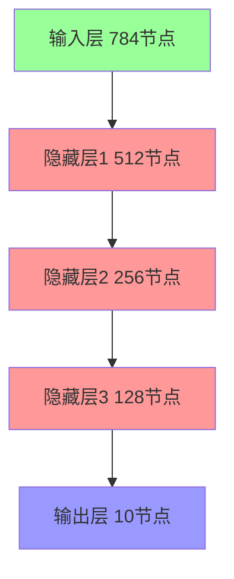

### 五、神经网络类型图谱
| 类型             | 结构特点               | 典型应用          |
|------------------|------------------------|-------------------|
| 全连接网络       | 每层神经元全部互联      | 基础分类/回归      |
| CNN              | 卷积层+池化层组合       | 图像处理 ✅        |
| RNN              | 带时间循环连接          | 文本/语言         |
| Transformer      | 自注意力机制            | NLP任务 ✅        |


**🚀 升级技巧：**

- 添加Dropout层：随机停工部分流水线（防过拟合）
- 批标准化(BatchNorm)：统一零件规格（加速训练）
- 迁移学习：直接使用预训练好的老师傅（如ResNet/VGG）

> 神经网络就像乐高工厂——通过简单的零件（神经元）组合，最终能建造出智能帝国大厦！  
> 现在就在**[Google Colab](https://colab.research.google.com/)**动手搭建你的第一个网络吧！

### 📚 ​​学习资源​​：
《[深度学习](https://github.com/exacity/deeplearningbook-chinese/tree/master)》(花书) - AI领域的"圣经"，配奶茶慢慢啃效果更佳 ☕

## [二、计算机视觉：机器的"眼睛" 0.0](Deep%20learning/计算机视觉.md)  
> 计算机视觉超全解析：从像素到智能识别的奇妙之旅 🌟  

### 1. 视觉世界的数字密码  

计算机视觉的第一步是把图像转化为数字语言：
```python
import numpy as np
from PIL import Image

# 加载一张猫咪图片
image = Image.open("cat.jpg")
pixel_data = np.array(image)

print(f"图片尺寸: {pixel_data.shape}")  # 例如 (480, 640, 3)
print("左上角像素值:", pixel_data[0, 0])  # 例如 [255, 200, 150]
```
像素矩阵揭秘​​：
```
RGB通道详解：
[ R: 255, G: 200, B: 150 ] → 亮橙红色
```

**高级技巧：通过以下操作增强图像：**
- Grayscale = 0.299*R + 0.587*G + 0.114*B (灰度转换)

- Histogram equalization (直方图均衡化提高对比度)

### 2. 特征工程：机器如何"看懂"图像
计算机需要提取图像的特征模式：  

| 传统方法          | 深度学习方法       | 特点对比                          |
|-------------------|--------------------|----------------------------------|
| SIFT旋转不变特征   | CNN卷积核          | 传统方法需手工设计，CNN自动学习    |
| HOG行人检测特征    | 注意力机制         | HOG只对特定目标有效，CNN泛化强    |
| LBP纹理特征        | 端到端特征提取     | 传统方法计算快，CNN精度高         |  

**卷积操作可视化：**
```python
原始图像： [1 1 1 0 0]
卷积核：   [1 0 -1]
结果：     [ (1 * 1)+(1 * 0)+(1*(-1)) = 0 ]
           [ (1 * 1)+(1 * 0)+(0*(-1)) = 1 ] → 边缘检测！
```
### 3. CNN：视觉处理的革命者
卷积神经网络工作原理全解析：
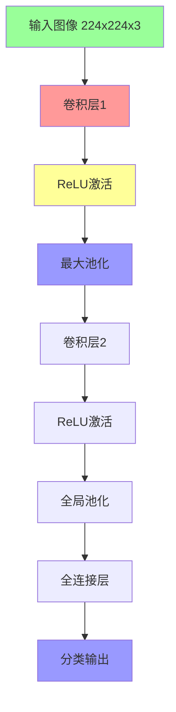
**核心组件详解​​：**

​​1. 卷积层​​：
- 使用3x3滤波器扫描图像
- 提取局部特征（边缘、纹理等）
- 多个滤波器组合检测复杂特征
  
​​2. ​​池化层​​：
- 降维操作（通常2x2区域取最大值）
- 增强位置不变性
- 保留重要特征

​​3. 实战代码​​（PyTorch版）：
```python
import torch
import torch.nn as nn

class SimpleCNN(nn.Module):
    def __init__(self):
        super().__init__()
        self.conv1 = nn.Conv2d(3, 32, 3) # 3通道输入, 32个卷积核, 3x3大小
        self.pool = nn.MaxPool2d(2, 2)  # 2x2池化
        self.conv2 = nn.Conv2d(32, 64, 3)
        self.fc1 = nn.Linear(64 * 54 * 54, 10) # 全连接层
        
    def forward(self, x):
        x = self.pool(torch.relu(self.conv1(x)))
        x = self.pool(torch.relu(self.conv2(x)))
        x = torch.flatten(x, 1) # 展平
        x = self.fc1(x)
        return x
```

### 4. 经典网络架构
计算机视觉的里程碑模型：
| 模型             | 创新点               | 贡献                      | 应用场景              |
|------------------|----------------------|--------------------------|-----------------------|
| AlexNet (2012)   | 首个深度CNN          | ImageNet冠军             | 通用分类             |
| VGG (2014)       | 统一3x3卷积          | 结构简洁高效              | 特征提取             |
| ResNet (2015)    | 残差连接             | 解决梯度消失              | 超深度网络(1000+层)  |
| YOLO (2016)      | 单次检测             | 实时目标检测              | 自动驾驶、视频监控   |
| U-Net (2015)     | 编码-解码结构        | 精细图像分割              | 医疗影像             |

### 5. 计算机视觉应用全景图
1. 目标检测：定位与识别
​​YOLO​​（You Only Look Once）算法：
```python
# 使用预训练YOLOv5模型检测物体
import torch
model = torch.hub.load('ultralytics/yolov5', 'yolov5s')  # 加载模型
results = model('street.jpg')  # 推理
results.print()  # 显示结果
results.save()   # 保存标注图像
```
**典型输出:**
```
检测结果: 
    car: 置信度0.87 位置 [x1=320, y1=210, x2=580, y2=390]
    person: 置信度0.92 位置 [x1=150, y1=300, x2=220, y2=480]
```
2. 图像分割：像素级识别
医疗图像分割示例：
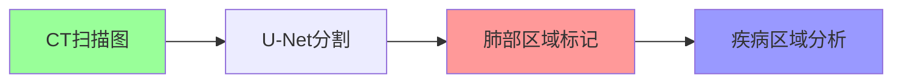
3. 图像生成：创造新内容
​​GAN对抗生成网络​​：
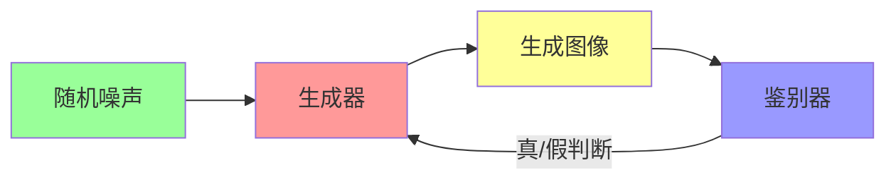
**使用GAN的应用：**
```python
from stylegan2 import generate_faces
generated_images = generate_faces(num=4)  # 生成4张人脸
```

### 6. 计算机视觉工具箱
完整开发流程：  

​​1. 数据处理
```python
import albumentations as A  # 强大的数据增强库

transform = A.Compose([
    A.RandomRotate30(),       # 随机旋转
    A.HorizontalFlip(p=0.5), # 水平翻转
    A.RGBShift(),             # 颜色偏移
    A.Normalize()             # 标准化
])
```

​​2. 迁移学习​​（利用预训练模型）
```python
from torchvision import models

# 加载预训练ResNet
model = models.resnet50(pretrained=True)

# 替换最后一层
model.fc = nn.Linear(2048, 10)  # 适配新任务的10分类
```

​​3. 模型部署
```
部署路径：
开发环境训练 → 转换为ONNX格式 → TensorRT加速 → 部署到边缘设备
```
### 7. 学习路线图
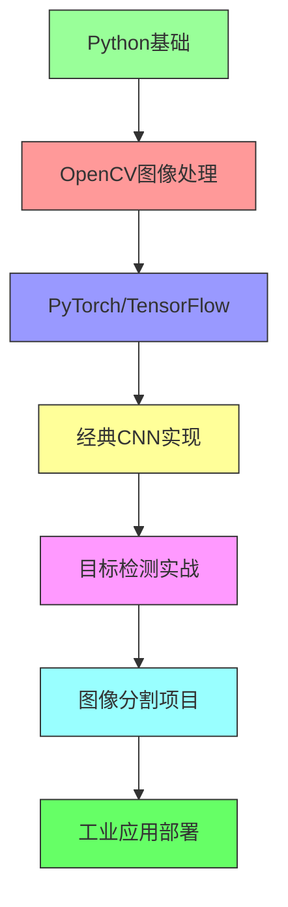

**计算机视觉正在改变世界：**

- 🚗 自动驾驶汽车实时感知环境
- 🏥 AI医疗影像辅助诊断
- 🛒 零售无人结账系统
- 🎨 AI艺术创作工具

**动手实践建议：**

- 从OpenCV基础操作开始
- 复现经典论文（如ResNet）
- 参加Kaggle计算机视觉比赛
- 尝试Gradio构建视觉应用演示

> ***"计算机不是天生能看见的，我们通过算法赋予它视觉认知能力。每一行代码都是机器视觉系统的一根神经元"***

### 🎥 ​​学习资源​​：
[斯坦福CS231n课程](https://www.bilibili.com/video/BV1nJ411z7fe/)（B站有中文版）→ 看5节课就能自己写图像识别程序！

## [三、NLP：让机器懂人话 💬](Deep%learning/nlp.md)
>  **自然语言处理（NLP）全景解析：从文字到智能的进化之路 📚**
>> ***"人类创造语言来理解世界，现在我们在教机器理解人类语言" - NLP研究者的使命***

### 一、NLP基础：让机器"识字"的三步法
**1. 分词：语言的基本拆解**
```python
import jieba  # 中文分词库

text = "自然语言处理让计算机理解人类语言"
words = jieba.cut(text)

print("分词结果:", "/".join(words))
# 输出: 自然/语言/处理/让/计算机/理解/人类/语言
```
分词技术对比​​：
| 语言   | 分词技术       | 特点                     |
|--------|----------------|--------------------------|
| 英语   | 空格切分       | 简单直接                 |
| 中文   | Jieba/HanLP    | 需结合词典和规则         |
| 日语   | MeCab          | 复杂的助词分离           |

**2. 词性标注：词语身份识别**
```
句子: "我爱编程"
分析:
    我/代词  爱/动词  编程/名词
```

**3. 句法分析：语言结构解析**
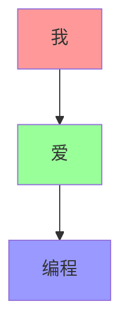

### 二、词表示革命：从符号到意义
**1. 传统方法：独热编码(One-Hot)**
```python
词典: ["apple", "banana", "orange"]
编码:
    apple: [1, 0, 0]
    banana: [0, 1, 0]
    orange: [0, 0, 1]
```
**缺陷**​​：无法表达词义关系，维度灾难

**2. 词嵌入(Word Embedding)：语义编码**

使用神经网络将词映射到低维空间：
```python
from gensim.models import Word2Vec

# 训练词向量模型
sentences = [["自然", "语言", "处理"], ["机器", "学习", "算法"]]
model = Word2Vec(sentences, vector_size=100, window=5, min_count=1)

# 获取词向量
vector = model.wv["语言"]
print(f"语言'的词向量维度: {vector.shape}")  # (100,)

# 计算相似度
similarity = model.wv.similarity("语言", "处理")
print(f"语言'与'处理'的语义相似度: {similarity:.2f}")
```
**3. 词向量魔法：语义代数**
```
vec(国王) - vec(男人) + vec(女人) ≈ vec(女王)
vec(巴黎) - vec(法国) + vec(日本) ≈ vec(东京)
```
### 三、NLP核心技术演进史
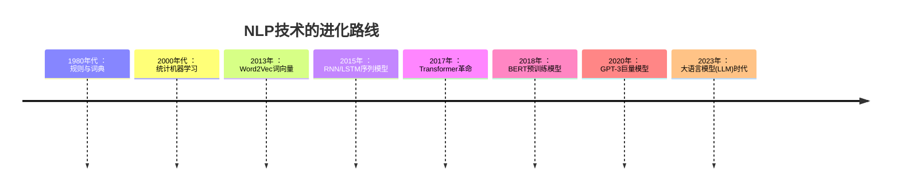
**1. RNN/LSTM：记忆增强网络**
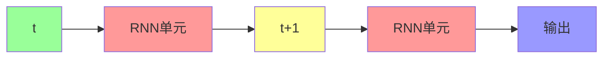
**应用场景**​​：文本生成、情感分析

**2. Transformer：注意力机制革命**
**​​核心创新​​**：自注意力机制
```
句子: "这只苹果手机很贵"
模型关注:
    "苹果" -> 60%关注"手机", 30%关注"贵"
    "贵" -> 70%关注"苹果", 25%关注"手机"
```
**3. BERT：双向理解**  

与传统模型的对比:
```mermaid
graph LR
    A[原始文本] --> B[单向模型]
    A --> C[BERT模型]
    B --> D[仅能利用上文]
    C --> E[同时利用上下文]
    
    style A fill:#9f9
    style B fill:#f99
    style C fill:#f99
    style D fill:#99f
    style E fill:#99f
```

### 四、现代NLP四大应用支柱
**1. 文本分类与情感分析**
```python
from transformers import pipeline

# 使用预训练情感分析模型
classifier = pipeline("sentiment-analysis")
result = classifier("这家餐厅的服务太棒了，食物也很美味！")

print(result)  
# [{'label': 'POSITIVE', 'score': 0.998}]
```

**2. 机器翻译：打破语言壁垒**
```
翻译流程：
中文 → 编码器 → 语义向量 → 解码器 → 英文
```

**多语言翻译实战**
```python
from transformers import MarianMTModel, MarianTokenizer

# 中译英
model_name = "Helsinki-NLP/opus-mt-zh-en"
tokenizer = MarianTokenizer.from_pretrained(model_name)
model = MarianMTModel.from_pretrained(model_name)

text = "自然语言处理正在改变世界"
translated = model.generate(**tokenizer(text, return_tensors="pt"))
output = tokenizer.decode(translated[0], skip_special_tokens=True)

print(output)  # "Natural language processing is changing the world"
```

**3. 问答系统：知识检索专家**
​​架构图​​：
```python
graph TD
    A[用户问题] --> B[问题解析]
    B --> C[知识库检索]
    C --> D[答案生成]
    D --> E[回答输出]
    
    style A fill:#9f9
    style E fill:#99f
```
**4. 文本生成：机器的创作能力**  

GPT系列创作示例：
```python
from transformers import GPT2LMHeadModel, GPT2Tokenizer

tokenizer = GPT2Tokenizer.from_pretrained("gpt2")
model = GPT2LMHeadModel.from_pretrained("gpt2")

input_text = "在未来的世界里，人工智能"
input_ids = tokenizer.encode(input_text, return_tensors="pt")

# 生成文本
output = model.generate(
    input_ids, 
    max_length=100,
    num_return_sequences=1
)

print(tokenizer.decode(output[0], skip_special_tokens=True))
```

***输出示例*​​**  

"在未来的世界里，人工智能将成为人类最强大的助手。它们不仅能处理复杂的计算任务，还能创造令人惊叹的艺术作品，甚至帮助科学家解决气候变化等全球性问题..."

### 五、NLP实战工具箱
**1. 现代NLP开发栈**
| 工具类型         | 代表工具               | 用途                  |
|------------------|------------------------|-----------------------|
| 基础库           | NLTK, SpaCy           | 文本预处理            |
| 深度学习框架     | PyTorch, TensorFlow    | 模型构建              |
| 预训练模型库     | Hugging Face           | 上千种预训练模型      |
| 可视化           | TensorBoard            | 训练过程监控          |

**2. Hugging Face使用示例**
```python
from transformers import AutoTokenizer, AutoModelForSequenceClassification

# 加载预训练模型和分词器
model_name = "bert-base-chinese"
tokenizer = AutoTokenizer.from_pretrained(model_name)
model = AutoModelForSequenceClassification.from_pretrained(model_name)

# 文本处理
inputs = tokenizer("NLP让计算机理解人类语言", return_tensors="pt")

# 模型推理
outputs = model(**inputs)
```

### 六、大语言模型（LLM）时代
**大模型四层结构：**
```mermaid
graph TD
    A[基础大模型] --> B[领域微调]
    B --> C[提示工程]
    C --> D[应用集成]
    
    style A fill:#9f9
    style B fill:#f99
    style C fill:#99f
    style D fill:#ff9
```
**ChatGPT类系统工作原理**：
```
输入 -> 文本编码 -> 大语言模型 -> 文本解码 -> 输出
                     ↑
              人类反馈强化学习
```

### 七、学习路线指南
```mermaid
flowchart LR
    A[Python基础] --> B[文本处理]
    B --> C[基础算法]
    C --> D[RNN/Transformer]
    D --> E[预训练模型]
    E --> F[应用开发]
    
    style A fill:#9f9,stroke:#333
    style B fill:#f99,stroke:#333
    style C fill:#99f,stroke:#333
    style D fill:#ff9,stroke:#333
    style E fill:#f9f,stroke:#333
    style F fill:#6f6,stroke:#333
```

**📃 推荐学习路径**​​：

1. 掌握Python和基础文本处理
2. 学习Word2Vec和TextCNN
3. 深入理解Transformer架构
4. 使用Hugging Face实现BERT/GPT
5. 开发实际NLP应用：
- 智能客服机器人
- 新闻自动摘要系统
- 法律文书分析工具

> ***"自然语言处理不仅是技术挑战，更是人类理解自身思维方式的窗口" - NLP先驱的思考***
>> *现在就开始你的[NLP](https://mofanpy.com/tutorials/machine-learning/nlp/intro-w2v)之旅吧！从训练第一个词向量模型到构建聊天机器人，每一步都在拉近人与机器的距离。🚀*

## 四、生成模型：机器的"想象力" 🎨  
**三大创作引擎​​：**
| 技术        | 代表作       | 创作能力                     |
|-------------|-------------|-----------------------------|
| GAN         | 人脸生成     | 图像生成/换脸                |
| Diffusion   | DALLE 2     | 文生图（输入"星空下的熊猫"出图） |
| LLMs        | ChatGPT     | 写诗/编码/聊人生             |

**GAN工作原理​​：**
```mermaid
%% 链表/树/图 - 使用Mermaid绘制
graph LR
    A[生成器] -->|伪造名画| B[鉴别器]
    B -->|鉴别真伪| A
    style A fill:#f9f
    style B fill:#9ff
```
- 生成器：像造假币的团队
- 鉴别器：像银行验钞机
- 双方对抗提升，直到假币无法被识别

### 💬 ​​学习资源​​：
[Hugging Face平台](https://huggingface.co/)（AI界GitHub）→ 直接在线体验Stable Diffusion生成图片！

> **💡 ​​关键提示**​​：深度学习≠魔法！先掌握基础理论再攻具体方向，遇到公式别怕→先跑通代码再回头理解理论效果更佳！

---

# **<h3 id="4">[🎯 阶段 3：工具与实践](https://github.com/0voice/learning-Journey-AI/tree/main/tools)</h3>**

本章是AI学习的基础工具,这里列出了从**框架、数据处理、深度学习、计算机视觉、强化学习到模型优化、MLOps和监控**等方面的常用工具。  

***所有工具的链接若过期请联系我进行补链***  

你可以根据你的需求选择对应方向文件中合适的工具进行学习和使用。  

**下面是常见的AI方向学习工具**
1. [Nebullvm](https://github.com/nebuly-ai/optimate) - 易于使用的库，通过多个深度学习编译器提升深度学习推理性能。
2. [Netron](https://github.com/lutzroeder/netron) - 用于深度学习和机器学习模型的可视化工具。
3. [Jupyter Notebook](http://jupyter.org) - 基于网页的交互式计算环境，用于笔记本编程。 
4. [TensorBoard](https://github.com/tensorflow/tensorboard) - TensorFlow 的可视化工具包。  
5. [Visual Studio Tools for AI](https://www.microsoft.com/en-us/research/project/visual-studio-code-tools-ai/) - 开发、调试和部署深度学习和 AI 解决方案。
6. [TensorWatch](https://github.com/microsoft/tensorwatch) - 深度学习的调试和可视化工具。
7. [ML Workspace](https://github.com/ml-tooling/ml-workspace) - 面向机器学习和数据科学的全功能网页 IDE。
8. [dowel](https://github.com/rlworkgroup/dowel) - 一个用于机器学习研究的小型日志工具。通过一次调用 logger.log() 可以将任何对象记录到控制台、CSV、TensorBoard、文本日志文件等。
9. [Neptune](https://neptune.ai/) - 轻量级的实验跟踪和结果可视化工具。
10. [CatalyzeX](https://chrome.google.com/webstore/detail/code-finder-for-research/aikkeehnlfpamidigaffhfmgbkdeheil) - 浏览器扩展（Chrome 和 Firefox），能够自动找到并链接 ML 论文中的代码实现，适用于 Google、Twitter、Arxiv、Scholar 等平台。
11. [Determined](https://github.com/determined-ai/determined) - 深度学习训练平台，集成了分布式训练、超参数调优、智能 GPU 调度、实验跟踪和模型注册的支持。
12. [DAGsHub](https://dagshub.com/) - 开源机器学习社区平台，轻松管理实验、数据和模型，并创建协作型机器学习项目。  
13. [hub](https://github.com/activeloopai/Hub) - 由 activeloop.ai 提供的最快无结构数据集管理工具。流式传输和版本控制数据，将大型数据转换为云端单一的 numpy-like 数组，任何机器都可访问。  
14. [DVC](https://dvc.org/) - DVC 被设计用于让机器学习模型可分享和可重现，处理大文件、数据集、机器学习模型、度量标准和代码。 
15. [CML](https://cml.dev/) - CML 帮助你将最喜欢的 DevOps 工具与机器学习结合起来。
16. [MLEM](https://mlem.ai/) - MLEM 是一个工具，可以轻松打包、部署和服务机器学习模型，支持实时服务和批处理等多种场景。
17. [Maxim AI](https://getmaxim.ai) - 用于 AI 智能体模拟、评估和可观察性的工具。


## 框架掌握(tools/框架.md)
***PyTorch***
**安装**
- 使用以下命令安装 PyTorch（根据你的操作系统选择对应版本）：
```bash
pip install torch torchvision torchaudio
```
- 你可以访问 PyTorch 官方网站选择适合你系统的版本：[PyTorch官网](https://pytorch.org/get-started/locally/)

***TensorFlow***
**安装**
- 安装 TensorFlow 的最新稳定版本：
```bash
pip install tensorflow
```
- 访问 [TensorFlow](https://www.tensorflow.org/install)官网获取更多安装选项。

***JAX***
**安装**
- 使用以下命令安装 JAX（安装 CPU 版本）：
```bash
pip install jax jaxlib
```
- 对于使用 GPU 的版本，可以使用以下命令：
```bash
pip install jax[cuda]
```
- 更多安装信息请访问：[JAX安装页面](https://docs.jax.dev/en/latest/installation.html)


## [数据处理与分析](tools/数据处理与分析.md)
***Pandas*** 
- 安装：
```bash
pip install pandas
```
- 访问 [Pandas官网](https://pandas.pydata.org/) 获取更多信息。

***NumPy***
- 安装：
```bash
pip install pandas
```
- 访问 [NumPy官网](https://numpy.org/) 了解更多。

***OpenCV***
- 安装：
```bash
pip install opencv-python
```
- 访问 [OpenCV官网](https://opencv.org/) 获取更多信息。

***NLTK (Natural Language Toolkit)***
- 安装：
```bash
pip install nltk
```
- 访问 [NLTK官网](https://www.nltk.org/) 获取更多信息。


***SciPy：***

- 用途：用于数学、科学和工程计算的库，提供了优化、线性代数、信号处理等功能。

- 安装：
```bash
pip install scipy
```

***Matplotlib：***

- 用途：数据可视化库，广泛用于生成静态、动态和交互式图表。

- 安装：

```bash
pip install matplotlib
```

***Seaborn：***

- 用途：基于 Matplotlib 的数据可视化库，提供更高级的接口来绘制统计图表。

- 安装：

```bash
pip install seaborn
```

***scikit-learn：***

- 用途：一个常用的机器学习库，提供了分类、回归、聚类等常见算法。

- 安装：

```bash
pip install scikit-learn
```

***Dask：***

- 用途：并行计算框架，能够扩展到大数据集。

- 安装：

```bash
pip install dask
```  
## [模型部署](tools/模型部署.md)
***ONNX (Open Neural Network Exchange)***

- 安装：

```bash
pip install onnx
```
- 访问 [ONNX官网](https://onnx.ai/) 获取更多信息。

***TensorRT***

- 安装：

- TensorRT 通常需要通过 NVIDIA 的官方网站进行下载。访问 [NVIDIA TensorRT](https://developer.nvidia.com/tensorrt) 以获取安装信息。

***Flask安装：***
```bash
pip install flask
```
***Django安装：***
```bash
pip install django
```
- 访问 [Flask官网](https://flask.palletsprojects.com/en/2.0.x/) 和 [Django官网](https://www.djangoproject.com/) 获取更多信息。

***TensorFlow Serving：***

- 用途：为 TensorFlow 模型提供高效的在线服务。

- 安装：

```bash
docker pull tensorflow/serving
```

***FastAPI：***

- 用途：现代的 Web 框架，用于构建 APIs，适合与深度学习模型一起部署。

- 安装：

```bash
pip install fastapi
```

***Streamlit：***

- 用途：用于快速创建和共享机器学习应用的工具。

- 安装：

```bash
pip install streamlit
```

## [MLOps基础和监控](tools/MLOps基础和监控.md)
***MLflow***

**安装：**

```bash
pip install mlflow
```
- 访问 [MLflow官网](https://mlflow.org/) 获取更多信息。

***Weights & Biases***

**安装：**

```bash
pip install wandb
```
- 访问 [Weights & Biases官网](https://wandb.ai/site) 获取更多信息。

***Docker***

**安装：**

- 访问 [Docker官网](https://www.docker.com/products/docker-desktop) 下载 Docker Desktop，适用于 Windows 和 macOS。

- 对于 Linux 用户，可以根据你的发行版使用包管理器进行安装。例如，对于 Ubuntu：
```bash
sudo apt install docker.io
```
- 访问 [Docker安装页面](https://docs.docker.com/get-docker/) 获取更多信息。

***Kubeflow：***

- 用途：为 Kubernetes 提供端到端的机器学习工作流工具。

**安装：**

```bash
pip install kubeflow
```

***TensorBoard：***

- 用途：TensorFlow 的可视化工具，用于查看训练过程中的各种指标。

**安装：**

```bash
pip install tensorboard
```

***Prometheus：***

- 用途：开源监控系统，能够监控机器学习工作流和部署。

**安装：**

```bash
docker pull prom/prometheus
```

## [强化学习](tools/强化学习.md)
***OpenAI Gym：***

- 用途：强化学习的工具包，提供各种模拟环境。

- 安装：

```bash
pip install gym
```

***Stable Baselines3：***

- 用途：强化学习的高效实现，基于 PyTorch。

- 安装：

```bash
pip install stable-baselines3
```

***Ray RLlib：***

- 用途：一个用于强化学习的分布式计算库，能够扩展到大规模分布式环境。

- 安装：
```bash
pip install ray[rllib]
```

## [模型优化与加速工具](tools/模型优化与加速工具.md)
***TensorFlow Lite：***

- 用途：用于在移动设备或边缘设备上运行深度学习模型的轻量级版本。

- 安装：

```bash
pip install tflite
```

***NVIDIA Apex：***

- 用途：NVIDIA 提供的库，优化 PyTorch 中的混合精度训练。

- 安装：

```bash
pip install apex
```

***Horovod：***

- 用途：分布式深度学习库，用于加速 TensorFlow、Keras 和 PyTorch 的训练。

- 安装：

```bash
pip install horovod
```

## [深度学习工具](tools/深度学习工具.md)
***Keras:***
- 用途：高层神经网络 API，支持 TensorFlow、Theano 等后端。

- 安装：

```bash
pip install keras
```

***Fastai：***

- 用途：一个构建在 PyTorch 之上的深度学习库，提供易用的 API 进行训练。

- 安装：

```bash
pip install fastai
```

***Hugging Face Transformers：***

- 用途：用于自然语言处理的预训练模型库，支持 Transformer 模型（如 BERT、GPT）。

- 安装：

```bash
pip install transformers
```

***MXNet：***

- 用途：Apache 维护的深度学习框架，支持多种深度学习模型。

- 安装：

```bash
pip install mxnet
```

***Chainer：***

- 用途：一种灵活的深度学习框架，适合快速原型设计和实验。

- 安装：

```bash
pip install chainer
```

## [自动化和工具集成.](tools/自动化和工具集成.md)
***Apache Airflow：***

- 用途：工作流调度和管理工具，用于自动化机器学习任务。

**安装：**

```bash
pip install apache-airflow
```

***Celery：***

- 用途：分布式任务队列，可以帮助你管理和调度后台任务。

**安装：**

```bash
pip install celery
```

***Luigi：***

- 用途：Python 任务框架，适用于批处理数据任务的调度。

**安装：**

```bash
pip install luigi
```

## [计算机视觉](tools/计算机视觉.md)
***PyTorch Lightning：***

- 用途：简化 PyTorch 代码的框架，减少样板代码，提高代码可维护性。

- 安装：

```bash
pip install pytorch-lightning
```

***Albumentations：***

- 用途：计算机视觉中的图像增强库，支持多种常用图像处理操作。

- 安装：

```bash
pip install albumentations
```

***Detectron2：***

- 用途：由 Facebook AI 研究院（FAIR）开发的目标检测框架，基于 PyTorch。

- 安装：

```bash
pip install detectron2
```

---

# 🚧 实战项目示例
## CNN图像分类示例 - PyTorch

```python
# CNN图像分类示例 - PyTorch
import torch
import torchvision
import torch.nn as nn
import torch.optim as optim
from torchvision import transforms, datasets
```

### 1. 加载数据集
```python
transform = transforms.Compose([
    transforms.ToTensor(),
    transforms.Normalize((0.5, 0.5, 0.5), (0.5, 0.5, 0.5))
])
train_set = datasets.CIFAR10(root='./data', train=True, download=True, transform=transform)
train_loader = torch.utils.data.DataLoader(train_set, batch_size=64, shuffle=True)
```

### 2. 构建CNN模型
```python
class CNNClassifier(nn.Module):
    def __init__(self):
        super(CNNClassifier, self).__init__()
        self.conv1 = nn.Conv2d(3, 32, kernel_size=3, padding=1)
        self.relu1 = nn.ReLU()
        self.pool1 = nn.MaxPool2d(2)
        self.conv2 = nn.Conv2d(32, 64, kernel_size=3, padding=1)
        self.relu2 = nn.ReLU()
        self.pool2 = nn.MaxPool2d(2)
        self.flatten = nn.Flatten()
        self.fc1 = nn.Linear(64 * 8 * 8, 512)
        self.relu3 = nn.ReLU()
        self.fc2 = nn.Linear(512, 10)

    def forward(self, x):
        x = self.pool1(self.relu1(self.conv1(x)))
        x = self.pool2(self.relu2(self.conv2(x)))
        x = self.flatten(x)
        x = self.relu3(self.fc1(x))
        x = self.fc2(x)
        return x

model = CNNClassifier()
```

### 3. 训练模型
```python
criterion = nn.CrossEntropyLoss()
optimizer = optim.Adam(model.parameters(), lr=0.001)

for epoch in range(10):
    running_loss = 0.0
    for i, (images, labels) in enumerate(train_loader, 0):
        optimizer.zero_grad()
        outputs = model(images)
        loss = criterion(outputs, labels)
        loss.backward()
        optimizer.step()
        
        running_loss += loss.item()
        
    print(f'Epoch {epoch+1}, Loss: {running_loss/len(train_loader):.4f}')

print('训练完成!')
```

## [🔍 更多完整项目：](Project)

- [NLP — NLP 实战项目集](https://github.com/0voice/learning-Journey-AI/tree/main/Project/NLP)
- [Phase0 — 基础编程练习合集](https://github.com/0voice/learning-Journey-AI/tree/main/Project/Phase0)
- [Phase1 — 机器学习基础项目集](https://github.com/0voice/learning-Journey-AI/tree/main/Project/Phase1)
- [Phase2 — 深度学习实战项目集（PyTorch）](https://github.com/0voice/learning-Journey-AI/tree/main/Project/Phase2)
- [Phase3：AI 计算机视觉实战项目合集](https://github.com/0voice/learning-Journey-AI/tree/main/Project/Phase3)
- [ai-chatbot](https://github.com/0voice/learning-Journey-AI/tree/main/Project/ai-chatbot)
- [ai-code-assistant](https://github.com/0voice/learning-Journey-AI/tree/main/Project/ai-code-assistant)
- [ai-image-search](https://github.com/0voice/learning-Journey-AI/tree/main/Project/ai-image-search)
- [ai-interviewer](https://github.com/0voice/learning-Journey-AI/tree/main/Project/ai-interviewer)
- [ai-math-grader](https://github.com/0voice/learning-Journey-AI/tree/main/Project/ai-math-grader)
- [universal-recommender](https://github.com/0voice/learning-Journey-AI/tree/main/Project/universal-recommender)
- [图像分类实战](https://github.com/0voice/learning-Journey-AI/blob/main/Project/%E5%9B%BE%E5%83%8F%E5%88%86%E7%B1%BB%E5%AE%9E%E6%88%98.md)
- [文本情感分析](https://github.com/0voice/learning-Journey-AI/blob/main/Project/%E6%96%87%E6%9C%AC%E6%83%85%E6%84%9F%E5%88%86%E6%9E%90.md)
- [聊天机器人构建](https://github.com/0voice/learning-Journey-AI/blob/main/Project/%E8%81%8A%E5%A4%A9%E6%9C%BA%E5%99%A8%E4%BA%BA%E6%9E%84%E5%BB%BA.md)


### 🔗 实用资源补充
| 类型      | 推荐链接                                                           |
| ------- | -------------------------------------------------------------- |
| 项目代码集   | [PyTorch Examples](https://github.com/pytorch/examples)        |
| AI课程项目库 | [Full Stack Deep Learning](https://fullstackdeeplearning.com/) |
| AI比赛    | [Kaggle Competitions](https://www.kaggle.com/competitions)     |
| NLP项目合集 | [Awesome NLP Projects](https://github.com/keon/awesome-nlp)    |

---

# 📚 核心资源总览
## [🎥在线课程推荐](Course)

1. [深度学习专项课程（Deep Learning Specialization）](https://www.coursera.org/specializations/deep-learning) - 吴恩达教授主讲，内容涵盖神经网络、CNN、RNN 等。

2. [《动手学深度学习》课程](https://courses.d2l.ai/zh-v2/) - 基于 PyTorch 和 MXNet 的深度学习实践课程。

3. [李宏毅深度学习教程](https://github.com/datawhalechina/leedl-tutorial) - 李宏毅教授的深度学习课程，内容深入浅出。

4. [Google 机器学习速成课程](https://developers.google.com/machine-learning/crash-course?hl=zh-cn) - 适合机器学习初学者的入门课程。

5. [NVIDIA 深度学习培训中心（DLI）](https://zh.wikipedia.org/wiki/NVIDIA%E6%B7%B1%E5%BA%A6%E5%AD%A6%E4%B9%A0%E5%9F%B9%E8%AE%AD%E4%B8%AD%E5%BF%83) - 提供深度学习、加速计算、数据科学等领域的开发培训。

6. [CS231n: Convolutional Neural Networks for Visual Recognition](http://cs231n.stanford.edu/) - 斯坦福大学的深度学习课程，专注于计算机视觉和卷积神经网络（CNN）。

7. [机器学习基础（Machine Learning by Stanford University）](https://www.coursera.org/learn/machine-learning?utm_source=chatgpt.com) - 由 Andrew Ng 主讲的经典机器学习课程，涵盖监督学习、非监督学习和其他基本概念。

8. [Fast.ai 深度学习课程](https://course.fast.ai/) - 基于 PyTorch 的深度学习快速入门课程，旨在让每个人都能快速实践深度学习。

9. [Deep Learning for Computer Vision (Udacity)](https://www.udacity.com/course/deep-learning-pytorch--ud188) - Udacity 提供的深度学习计算机视觉课程，教授如何使用 PyTorch 实现图像分类、目标检测等任务。

10. [Deep Learning Nanodegree (Udacity)](https://www.udacity.com/course/deep-learning-nanodegree--nd101) - Udacity 的深度学习纳米学位课程，覆盖神经网络、卷积神经网络、生成对抗网络（GAN）等内容。

11. [CS224n: Natural Language Processing with Deep Learning](https://web.stanford.edu/class/cs224n/) - 斯坦福大学的深度学习自然语言处理课程，重点讲解如何利用深度学习技术进行文本处理和分析。

12. [Deep Learning with TensorFlow](https://www.edx.org/course/deep-learning-with-tensorflow) - edX 上的 TensorFlow 深度学习课程，适合想要学习使用 TensorFlow 进行深度学习的开发者。

13. [Practical Deep Learning for Coders](https://course.fast.ai/) - Fast.ai 提供的在线课程，面向开发者，通过实践讲解深度学习的核心概念和应用。

14. [MIT 6.S191: Introduction to Deep Learning](http://introtodeeplearning.com/) - 麻省理工学院的深度学习入门课程，涵盖基本的深度学习概念、卷积神经网络、生成对抗网络等。

15. [Data Science and Machine Learning Bootcamp with R](https://www.udemy.com/course/data-science-and-machine-learning-bootcamp-with-r/) - Udemy 上的 R 语言数据科学和机器学习课程，适合想用 R 进行机器学习的开发者。

16. [AI for Everyone (Coursera)](https://www.coursera.org/learn/ai-for-everyone) - 吴恩达教授的人工智能入门课程，旨在为没有技术背景的人提供 AI 基础知识。

17. [Deep Learning with PyTorch](https://pytorch.org/tutorials/) - PyTorch 官方提供的深度学习教程，涵盖从基础到高级的深度学习知识，适合不同水平的学习者。

18. [Reinforcement Learning Specialization](https://www.coursera.org/specializations/reinforcement-learning) - Coursera 上的强化学习专项课程，教授强化学习的核心概念和实际应用。

19. [Stanford CS20: TensorFlow for Deep Learning Research](https://web.stanford.edu/class/cs20si/) - 斯坦福大学的课程，深入讲解 TensorFlow 及其在深度学习研究中的应用。

20. [Applied Data Science with Python (University of Michigan)](https://www.coursera.org/specializations/data-science-python) - 密歇根大学的 Python 数据科学应用课程，涵盖机器学习、数据处理、数据可视化等内容。

21. [Introduction to Machine Learning with Python](https://www.udemy.com/course/machine-learning-with-python/) - Udemy 提供的 Python 机器学习入门课程，适合刚接触机器学习的初学者。

22. [Practical Reinforcement Learning](https://www.udemy.com/course/practical-reinforcement-learning/) - Udemy 上的强化学习实践课程，涵盖 Q-learning、深度 Q 网络等强化学习方法。

23. [Mastering Machine Learning with scikit-learn](https://www.udemy.com/course/master-machine-learning-with-scikit-learn/) - Udemy 上的 scikit-learn 机器学习课程，适合 Python 用户使用 scikit-learn 库进行机器学习。

24. [Introduction to Artificial Intelligence (AI)](https://www.edx.org/course/artificial-intelligence-ai) - edX 提供的人工智能入门课程，适合 AI 初学者，覆盖基础概念、应用和方法。

25. [AI for Robotics (Udacity)](https://www.udacity.com/course/ai-for-robotics--ud980) - Udacity 上的人工智能与机器人课程，涵盖路径规划、视觉处理等 AI 在机器人领域的应用。

26. [AI Programming with Python (Udacity)](https://www.udacity.com/course/ai-programming-with-python-nanodegree--nd089) - Udacity 提供的 AI 编程课程，适合初学者，涵盖 Python 编程、NumPy、Pandas、Matplotlib、PyTorch 和深度学习基础。

27. [Neural Networks and Deep Learning (Coursera)](https://www.coursera.org/learn/neural-networks-deep-learning) - 由 Andrew Ng 主讲的神经网络与深度学习课程，适合深度学习初学者。

28. [Intro to TensorFlow for Deep Learning (Udacity)](https://www.udacity.com/course/intro-to-tensorflow-for-deep-learning--ud187) - 由 Udacity 提供的 TensorFlow 深度学习入门课程，学习如何使用 TensorFlow 构建深度学习模型。

29. [Reinforcement Learning (Udacity)](https://www.udacity.com/course/reinforcement-learning--ud600) - Udacity 提供的强化学习课程，适合希望深入理解强化学习及其应用的开发者。

30. [Applied AI with DeepLearning (Coursera)](https://www.coursera.org/specializations/applied-ai) - 深入学习如何将 AI 和深度学习应用到实际项目中，包括计算机视觉和自然语言处理。

31. [Practical Deep Learning for Coders v4 (Fast.ai)](https://course.fast.ai/) - Fast.ai 提供的深度学习实践课程，适合希望在 PyTorch 上快速构建深度学习项目的开发者。

32. [Deep Reinforcement Learning (Coursera)](https://www.coursera.org/specializations/deep-reinforcement-learning) - 课程专注于深度强化学习的应用，覆盖算法、环境和模型训练等内容。

33. [Introduction to Deep Learning with Keras (DataCamp)](https://www.datacamp.com/courses/deep-learning-with-keras) - DataCamp 提供的 Keras 深度学习入门课程，帮助学生理解神经网络和深度学习的基础概念。

34. [Neural Networks and Deep Learning (Stanford)](http://cs231n.stanford.edu/) - 斯坦福大学深度学习课程，专注于计算机视觉和深度神经网络的应用。

35. [Machine Learning with TensorFlow on Google Cloud (Coursera)](https://www.coursera.org/professional-certificates/machine-learning-tensorflow-gcp) - 由 Google 提供的 TensorFlow 和机器学习课程，学习如何在 Google Cloud 上部署机器学习模型。

36. [Building Conversational Experiences with Dialogflow (Coursera)](https://www.coursera.org/learn/building-conversational-experiences-dialogflow) - Google 提供的课程，学习如何使用 Dialogflow 构建聊天机器人。

37. [Advanced Machine Learning Specialization (Coursera)](https://www.coursera.org/specializations/advanced-machine-learning) - 适合具有机器学习基础的学生，课程涉及深度学习、计算机视觉、自然语言处理等高级主题。

38. [Data Science and Machine Learning Bootcamp with R (Udemy)](https://www.udemy.com/course/data-science-and-machine-learning-bootcamp-with-r/) - 使用 R 语言进行数据科学和机器学习的入门课程，适合初学者。

39. [Introduction to Machine Learning with Python (Udemy)](https://www.udemy.com/course/machine-learning-with-python/) - 通过 Python 学习机器学习的基础，包括监督学习、非监督学习和模型评估等。

40. [Deep Learning for Business with TensorFlow (Udemy)](https://www.udemy.com/course/deep-learning-for-business-with-tensorflow/) - 深度学习商业应用课程，专注于利用 TensorFlow 构建商业智能和预测模型。

41. [Natural Language Processing with Deep Learning in Python (Udemy)](https://www.udemy.com/course/natural-language-processing-with-deep-learning-in-python/) - 通过 Python 学习使用深度学习进行自然语言处理（NLP）。

42. [Computer Vision with Python (Udemy)](https://www.udemy.com/course/computer-vision-with-python/) - 使用 Python 和 OpenCV 学习计算机视觉技术，涵盖图像处理、对象检测等内容。

43. [Generative Adversarial Networks (GANs) Specialization (Coursera)](https://www.coursera.org/specializations/generative-adversarial-networks) - Coursera 上的 GANs 专项课程，深入学习生成对抗网络（GAN）和其应用。

44. [TensorFlow for Deep Learning (Udacity)](https://www.udacity.com/course/intro-to-tensorflow-for-deep-learning--ud187) - 通过 TensorFlow 学习深度学习模型的创建和训练，适合有编程基础的学习者。

45. [AI Programming with Python Nanodegree (Udacity)](https://www.udacity.com/course/ai-programming-with-python-nanodegree--nd089) - Udacity 的 AI 编程课程，涵盖 Python 编程、数据结构、算法和深度学习。

46. [Machine Learning with Python (Coursera)](https://www.coursera.org/learn/machine-learning-with-python) - 由 IBM 提供的机器学习课程，使用 Python 讲解机器学习算法和实践。

47. [Deep Learning with PyTorch (Udacity)](https://www.udacity.com/course/deep-learning-pytorch--ud188) - 使用 PyTorch 进行深度学习的课程，适合学习者想要深入理解神经网络和模型训练。

48. [Artificial Intelligence: A Modern Approach (Stanford)](https://www.ai-class.com/) - 斯坦福大学的经典人工智能课程，涉及搜索算法、学习算法、逻辑推理等领域。

49. [ML and AI for Business (Udemy)](https://www.udemy.com/course/machine-learning-and-artificial-intelligence-for-business/) - 适合商业专业人士的 AI 和机器学习课程，学习如何将这些技术应用于实际业务场景中。

50. [Mastering Machine Learning with Python (Udemy)](https://www.udemy.com/course/master-machine-learning-with-python/) - 通过 Python 学习如何构建机器学习模型，包括从数据预处理到模型部署的全过程。

51. [AI with Python (Udemy)](https://www.udemy.com/course/artificial-intelligence-with-python/) - 介绍如何使用 Python 实现人工智能应用，适合 AI 初学者。

52. [Introduction to Artificial Intelligence with Python (Harvard)](https://www.edx.org/course/cs50s-introduction-to-artificial-intelligence-with-python) - 哈佛大学的 AI 入门课程，使用 Python 讲解人工智能技术，包括搜索算法、神经网络等。

53. [Applied Machine Learning (Coursera)](https://www.coursera.org/specializations/applied-machine-learning) - 专注于机器学习算法的实际应用，涵盖回归、分类、聚类、特征选择等。

54. [Advanced Deep Learning & Reinforcement Learning (Udacity)](https://www.udacity.com/course/advanced-deep-learning-and-reinforcement-learning-nanodegree--nd893) - Udacity 提供的深度学习和强化学习高级课程，适合有基础的学习者，深入理解复杂模型和算法。

## [📖电子书籍精选](books)

1. [《深度学习》 - Ian Goodfellow, Yoshua Bengio, Aaron Courville](https://www.deeplearningbook.org/)  
   深度学习领域的经典教材，涵盖了深度学习的基础知识、卷积神经网络、递归神经网络等内容。

2. [《机器学习实战》 - Andrew Ng](https://www.deeplearning.ai/machine-learning-yearning/)  
   吴恩达教授编写的机器学习实践指南，重点讲解如何搭建、调优和优化机器学习系统。

3. [《动手学深度学习》 - 赵志红, 李沐](https://zh.d2l.ai/)  
   基于 Python 和 MXNet 的深度学习实践书籍，适合从零开始的学习者。

4. [《Python机器学习》 - Sebastian Raschka](https://sebastianraschka.com/books.html)  
   介绍如何使用 Python 及其相关库（如 scikit-learn）来实现机器学习算法，适合初学者和中级开发者。

5. [《Python 深度学习》 - François Chollet](https://www.packtpub.com/product/python-deep-learning-second-edition/9781838983011)  
   Keras 的创造者 François Chollet 编写的深度学习书籍，结合了理论与实践，适合开发者和数据科学家。

6. [《深度学习入门：基于Python的理论与实现》 - 斋藤康毅](https://www.oreilly.com/library/view/deep-learning-from/9781492041412/)  
   本书以 TensorFlow 和 Keras 为工具，讲解深度学习的基本原理和实现方法。

7. [《机器学习：概率视角》 - Kevin P. Murphy](http://www.cs.ubc.ca/~murphyk/MLbook/)  
   深入探讨机器学习中的概率模型和推理方法。

8. [《强化学习：An Introduction》 - Richard S. Sutton & Andrew G. Barto](http://incompleteideas.net/book/the-book-2nd.html)  
   深入讲解强化学习的经典教材，重点介绍强化学习的核心算法和应用。

9. [《深度强化学习》 - 刘建平](https://book.douban.com/subject/27030016/)  
   详细讲解了深度强化学习的基本理论、常用算法以及应用。

10. [《TensorFlow 深度学习》 - 认证作者](https://www.packtpub.com/product/learn-tensorflow-2-0/9781800206025)  
    该书详细讲解了 TensorFlow 框架的使用方法，适合希望掌握 TensorFlow 并应用于实际项目的读者。

11. [《统计学习方法》 - 李航](https://github.com/cszhangzhen/MachineLearning)  
    详细介绍了统计学习方法，重点讲解了支持向量机（SVM）、决策树、神经网络等常用算法。

12. [《机器学习》 - 周志华](https://github.com/datawhalechina/leedl-tutorial)  
    系统介绍机器学习的主要方法，包括监督学习、无监督学习、强化学习等内容。

13. [《计算机视觉：算法与应用》 - Richard Szeliski](http://szeliski.org/Book/)  
    介绍计算机视觉的基础理论和实际应用，适合计算机视觉研究人员和开发者。

14. [《深度学习与计算机视觉》 - 李沐](https://zh.d2l.ai/chapter_computer-vision/index.html)  
    专注于深度学习在计算机视觉中的应用，包括图像分类、目标检测、图像生成等。

15. [《Hands-On Machine Learning with Scikit-Learn, Keras, and TensorFlow》 - Aurélien Géron](https://www.oreilly.com/library/view/hands-on-machine-learning/9781492032630/)  
    通过 Scikit-Learn、Keras 和 TensorFlow 实现机器学习和深度学习，覆盖了实际项目中的常见问题和解决方案。

16. [《深度学习：构建神经网络的艺术与科学》 - 迈克尔·尼尔森](https://www.nature.com/articles/167101)  
    深入浅出地讲解了神经网络的构建和训练，适合有一定基础的学习者。

17. [《深度学习实战：基于TensorFlow与Keras》 - 杨青](https://www.packtpub.com/product/learn-tensorflow-2-0/9781800206025)  
    本书通过大量实例，深入讲解了如何使用 TensorFlow 和 Keras 进行深度学习。

18. [《Data Science from Scratch》 - Joel Grus](https://www.oreilly.com/library/view/data-science-from/9781492041139/)  
    从零开始讲解数据科学，包括数据清洗、可视化、机器学习等。

19. [《Python for Data Analysis》 - Wes McKinney](https://www.oreilly.com/library/view/python-for-data/9781491957660/)  
    通过 Python 的 Pandas 库进行数据分析，适合数据科学领域的初学者和中级学习者。

20. [《Machine Learning Yearning》 - Andrew Ng](https://www.deeplearning.ai/machine-learning-yearning/)  
    吴恩达教授的机器学习实践指南，重点讲解如何搭建、调优和优化机器学习系统。

21. [《Hands-On Deep Learning with TensorFlow》 - Dan Van Boxel](https://www.packtpub.com/product/hands-on-deep-learning-with-tensorflow/9781788621757)  
    通过 TensorFlow 构建深度学习模型，并学习如何调优和部署。

22. [《AI Superpowers: China, Silicon Valley, and the New World Order》 - Kai-Fu Lee](https://www.amazon.com/AI-Superpowers-Silicon-Valley-Order/dp/1328691804)  
    讨论人工智能的未来发展，特别是中国和硅谷的AI竞争。

23. [《Deep Reinforcement Learning Hands-On》 - Maxim Lapan](https://www.packtpub.com/product/deep-reinforcement-learning-hands-on/9781838984393)  
    通过实践学习深度强化学习，内容涵盖深度 Q 网络（DQN）、策略梯度等强化学习方法。

24. [Data Science from Scratch by Joel Grus](https://www.oreilly.com/library/view/data-science-from/9781492041139/)  
    从零开始讲解数据科学，包括数据清洗、可视化、机器学习等。

25. [Deep Learning for Computer Vision by Rajalingappaa Shanmugamani](https://www.packtpub.com/product/deep-learning-for-computer-vision/9781788621757)  
    深度学习在计算机视觉中的应用，涵盖从图像分类到目标检测等多个应用。

## [📰经典论文](papers)

- [Attention is All You Need](https://arxiv.org/abs/1706.03762)

- [ResNet (Deep Residual Learning)](https://arxiv.org/abs/1512.03385)

- [BERT: Pre-training of Deep Bidirectional Transformers](https://arxiv.org/abs/1810.04805)

### 🔮 通用大模型 / 基础模型（Foundation Models）
| 论文       | 链接                                                                                                                              | 关键词            |
| -------- | ------------------------------------------------------------------------------------------------------------------------------- | -------------- |
| GPT-4    | [GPT-4 Technical Report (2023)](https://arxiv.org/abs/2303.08774)                                                               | 大语言模型          |
| LLaMA 2  | [LLaMA 2: Open Foundation and Fine-Tuned Chat Models (2023)](https://arxiv.org/abs/2307.09288)                                  | 开源大模型          |
| Mistral  | [Mistral: Faster and Better (2023)](https://arxiv.org/abs/2310.06825)                                                           | 高效 Transformer |
| Gemini   | [Gemini 1: Unlocking multimodal understanding (2023)](https://storage.googleapis.com/deepmind-media/gemini/gemini_1_report.pdf) | 多模态            |
| Claude 3 | [Anthropic Claude 3 Report (2024)](https://www.anthropic.com/index/claude-3)                                                    | 多模态对话          |


### 🧠 自然语言处理（NLP）
| 论文          | 链接                                                                                                                           | 关键词             |
| ----------- | ---------------------------------------------------------------------------------------------------------------------------- | --------------- |
| BERT        | [BERT: Pre-training of Deep Bidirectional Transformers (2018)](https://arxiv.org/abs/1810.04805)                             | Transformer 编码器 |
| T5          | [Exploring the Limits of Transfer Learning with a Unified Text-to-Text Transformer (2020)](https://arxiv.org/abs/1910.10683) | 文本统一框架          |
| InstructGPT | [Training language models to follow instructions (2022)](https://arxiv.org/abs/2203.02155)                                   | RLHF            |
| LoRA        | [LoRA: Low-Rank Adaptation of Large Language Models (2021)](https://arxiv.org/abs/2106.09685)                                | 微调方法            |


### 🧑‍🎨 计算机视觉（CV）
| 论文                 | 链接                                                                                                | 关键词     |
| ------------------ | ------------------------------------------------------------------------------------------------- | ------- |
| Vision Transformer | [An Image is Worth 16x16 Words (2020)](https://arxiv.org/abs/2010.11929)                          | ViT     |
| DINOv2             | [DINOv2 (2023)](https://arxiv.org/abs/2304.07193)                                                 | 自监督视觉模型 |
| Segment Anything   | [Segment Anything (2023)](https://arxiv.org/abs/2304.02643)                                       | 图像分割    |
| CLIP               | [CLIP: Learning Transferable Visual Models (2021)](https://arxiv.org/abs/2103.00020)              | 图文对齐    |
| DreamBooth         | [DreamBooth: Fine Tuning Text-to-Image Diffusion Models (2022)](https://arxiv.org/abs/2208.12242) | 个性化图像生成 |

### 🔍 多模态（图文/视频/语音）
| 论文       | 链接                                                                                              | 关键词   |
| -------- | ----------------------------------------------------------------------------------------------- | ----- |
| Flamingo | [Flamingo: A Visual Language Model (2022)](https://arxiv.org/abs/2204.14198)                    | 图文问答  |
| BLIP-2   | [BLIP-2: Bootstrapping Language-Image Pre-training (2023)](https://arxiv.org/abs/2301.12597)    | 图文生成  |
| Whisper  | [Whisper: Robust Speech Recognition (2022)](https://openai.com/research/whisper)                | 语音识别  |
| SpeechT5 | [SpeechT5: Unified-Modal Encoder-Decoder Pre-training (2022)](https://arxiv.org/abs/2110.07205) | 多语种语音 |

### 🤖 强化学习 / 自动智能体（Agent）
| 论文         | 链接                                                                                             | 关键词        |
| ---------- | ---------------------------------------------------------------------------------------------- | ---------- |
| AlphaGo    | [Mastering the game of Go (2016)](https://www.nature.com/articles/nature16961)                 | 强化学习经典     |
| ReAct      | [ReAct: Synergizing Reasoning and Acting (2022)](https://arxiv.org/abs/2210.03629)             | 语言模型 Agent |
| AutoGPT    | [Auto-GPT (GitHub Repo)](https://github.com/Torantulino/Auto-GPT)                              | LLM 自动规划   |
| Voyager    | [Voyager: LLM-Powered Embodied Agent in Minecraft (2023)](https://voyager.minedojo.org/)       | 游戏 AI      |
| OpenAgents | [OpenAgents: An Open Platform for LLM Agent Research (2024)](https://arxiv.org/abs/2404.13722) | 多任务智能体     |

### 📊 向量检索 / 向量数据库 / Embedding
| 论文               | 链接                                                                                     | 关键词     |
| ---------------- | -------------------------------------------------------------------------------------- | ------- |
| FAISS            | [FAISS: Efficient Similarity Search (2017)](https://github.com/facebookresearch/faiss) | 向量检索库   |
| HNSW             | [HNSW: Efficient and Robust ANN (2018)](https://arxiv.org/abs/1603.09320)              | 高效 ANN  |
| GTE              | [GTE: General Text Embeddings (2023)](https://huggingface.co/thenlper/gte-base)        | 通用文本向量  |
| OpenAI Embedding | [OpenAI Text Embeddings (2022)](https://platform.openai.com/docs/guides/embeddings)    | GPT 向量化 |


---

# 💖 致谢

- 开源社区提供的优秀工具

- 教育先驱：社会各界AI学者，吴恩达教授等教育先驱

- 您！每一位使用和传播资料的学习者

> “人工智能如同新时代的电力，将重塑所有行业。” — Andrew Ng  
> 🌱 开启你的 AI 学习之旅，就从这里开始！
