# 🚀🚀🚀 AI Learning Hub · 2025 最强 AI 学习路线，从入门到实战，全流程自学指南

---

<p align="center">
  
</p>

---

> **掌握 AI，从这里开始**  
> 为所有对 AI 知识感兴趣的学习者打造的 AI / ML / DL 系统学习路线，涵盖优质课程、经典书籍、融合顶级资源、代码实战与开源工具，为你打造从入门到实战再到前沿研究的 AI 成长之路。  
>> **结构化 | 持续更新 | 最新学习 |社区共建** [](https://github.com/0voice/learning-Journey-AI)

---

🎯 **适合对象**：  
- 想从零起步学习 AI 的开发者  
- 需要一条系统、可落地的学习路径的学习者  
- 关注行业一线进展，想掌握前沿技术的人

🌟 **你将获得**：  
✅ 清晰的阶段性学习路线图  
✅ 精选高质量学习资源与工具  
✅ 覆盖从基础到进阶的实战项目  
✅ 定期更新，聚焦主流与前沿  
✅ 欢迎开源社区共同建设

> 💡**不再信息过载，不再无从下手，从这里开始系统掌握 AI。**

---

## ✈️ 学习路线图 Overview

```mermaid
flowchart TD
    A[编程基础Python] --> B[数学基础]
    B --> C[机器学习]
    C --> D[深度学习基础]
    D --> E[计算机视觉]
    D --> F[自然语言处理]
    D --> G[生成式AI]
    C --> H[工具链实践]
    H --> I[部署与MLOps]
    E & F & G --> J[专项项目实战]
    style A fill:#4CAF50,stroke:#388E3C
```

# 📚 学习路径分阶段

---

# 📌 [阶段 0：前置知识](https://github.com/0voice/learning-Journey-AI/tree/main/Python%20and%20Math) - [Python入门基础：零基础小白学习指南](Python%20and%20Math/python.md) 


### 1.变量与数据类型
变量就像生活中的“标签”，给数据起名字方便使用：
```python
# 创建变量
name = "小明"        # 字符串 (文字)
age = 20             # 整数 (数字)
height = 1.75        # 浮点数 (带小数点的数字)
is_student = True    # 布尔值 (真/假)

print(name)          # 输出: 小明
print(age + 5)       # 输出: 25
```

### 2.控制结构：条件判断
如果...那么...否则...的逻辑：
```python
# 条件判断示例
temperature = 28

if temperature > 30:
    print("太热了！开空调")
elif temperature > 20:
    print("天气真舒服")
else:
    print("有点冷，多穿点")
```

### 3.控制结构：循环
重复执行某些操作：
```python
# for循环示例 - 遍历序列
fruits = ["苹果", "香蕉", "橙子"]

for fruit in fruits:
    print(f"我爱吃{fruit}")

# while循环示例 - 达到条件前重复
count = 0
while count < 5:
    print(f"这是第{count+1}次说你好")
    count += 1
```

### 4. 函数定义与调用
把常用操作打包成"工具"：
```python
# 定义函数：计算圆的面积
def circle_area(radius):
    area = 3.14 * radius * radius
    return area

# 使用函数
print(circle_area(5))  # 计算半径为5的圆面积
```
### 5. 类与面向对象编程
创建自定义的数据类型：
```python
# 定义"汽车"类
class Car:
    # 初始化方法(给新车设置属性)
    def __init__(self, brand, color):
        self.brand = brand
        self.color = color
    
    # 类的方法(行为)
    def drive(self):
        print(f"{self.color}色的{self.brand}正在行驶")

# 使用类创建对象
my_car = Car("特斯拉", "黑")
my_car.drive()  # 输出: 黑色的特斯拉正在行驶
```

### 6. 异常处理
防止程序出错时崩溃：
```python
# 尝试打开一个不存在的文件
try:
    file = open("不存在的文件.txt", "r")
except FileNotFoundError:
    print("找不到文件！请检查文件名")
```

## 数据结构基础

### 1.列表/元组/字典/集合
| 类型   | 特点                 | 示例                                 |
|--------|----------------------|--------------------------------------|
| 列表   | 可修改的有序集合     | `fruits = ["苹果", "香蕉", "橙子"]`  |
| 元组   | 不可修改的有序集合   | `point = (3, 5)`                     |
| 字典   | 键值对集合           | `student = {"姓名": "小明", "年龄": 20}` |
| 集合   | 无重复元素的无序集   | `unique_numbers = {1, 2, 3, 2} → {1, 2, 3}` |
```python
# 综合示例
# 购物清单（列表）
shopping_list = ["牛奶", "鸡蛋", "面包"]

# 商品价格（字典）
prices = {
    "牛奶": 15.5,
    "鸡蛋": 12.8,
    "面包": 8.0
}

# 计算总价
total = 0
for item in shopping_list:
    if item in prices:
        total += prices[item]

print(f"购物总价: {total}元")  # 输出: 购物总价: 36.3元
```
### 2.栈与队列
两种数据操作方式：
- ​​栈（Stack）​​：后进先出（LIFO），像叠盘子
```python
# 使用列表实现栈
stack = []
stack.append("第1盘")  # 放入
stack.append("第2盘")
top = stack.pop()      # 取出: "第2盘"
```
- ​​队列（Queue）​​：先进先出（FIFO），像排队
```python
# 使用队列
from collections import deque
queue = deque()
queue.append("第1人")  # 排队
queue.append("第2人")
first = queue.popleft()  # 服务: "第1人"
```

### 3. 链表/树/图
常用数据结构可视化比较：
```mermaid
%% 链表/树/图 - 使用Mermaid绘制
graph TD
    A[数据结构] --> B[线性]
    A --> C[非线性]
    
    B --> D[链表]
    D --> D1[单向链表]
    D --> D2[双向链表]
    
    C --> E[树]
    E --> E1[二叉树]
    E --> E2[平衡树]
    
    C --> F[图]
    F --> F1[有向图]
    F --> F2[无向图]
```
实际应用：
- ​​链表​​：浏览器历史记录
- 树​​：文件系统组织
- 图​​：社交网络关系

### 4. 时间/空间复杂度分析
评估算法效率的方法：
- 时间复杂度​​：算法运行时间随输入规模增长的变化
- 空间复杂度​​：算法运行所需内存空间的变化

常见时间复杂度：
- O(1) - 固定时间（最好）
- O(log n) - 对数时间（很好）
- O(n) - 线性时间（好）
- O(n²) - 平方时间（较差）

示例：查找列表中是否存在某元素
```python
# 简单查找 - O(n)
def simple_search(items, target):
    for item in items:
        if item == target:
            return True
    return False

# 二分查找（有序列表）- O(log n)
def binary_search(items, target):
    low, high = 0, len(items)-1
    while low <= high:
        mid = (low + high) // 2
        if items[mid] == target:
            return True
        elif items[mid] < target:
            low = mid + 1
        else:
            high = mid - 1
    return False
```

# 算法基础
## 1. 搜索算法
在数据集中查找特定元素：
| 方法       | 场景         | 优点         | 缺点               |
|------------|--------------|--------------|--------------------|
| 线性搜索   | 无序列表     | 简单直接     | 效率低(O(n))      |
| 二分搜索   | 有序列表     | 高效(O(log n)) | 要求列表有序       |

示例：二分查找实现
```python
def binary_search(items, target):
    # 起点和终点索引
    low, high = 0, len(items)-1
    
    while low <= high:
        # 计算中间位置
        mid = (low + high) // 2
        mid_value = items[mid]
        
        # 找到目标
        if mid_value == target:
            return mid
        
        # 目标在右侧
        elif mid_value < target:
            low = mid + 1
        
        # 目标在左侧
        else:
            high = mid - 1
    
    # 未找到
    return -1
```
## 2. 排序算法
重新排列元素顺序：
| 方法       | 平均复杂度       | 特点              |
|------------|------------------|-------------------|
| 冒泡排序   | \( O(n^2) \)     | 简单但慢          |
| 快速排序   | \( O(n \log n) \) | 高效，常用        |
| 归并排序   | \( O(n \log n) \) | 稳定，大数据处理  |

快速排序示例：
```python
def quicksort(arr):
    if len(arr) <= 1:
        return arr
    
    pivot = arr[len(arr) // 2]  # 选择中间值作为基准
    left = [x for x in arr if x < pivot]
    middle = [x for x in arr if x == pivot]
    right = [x for x in arr if x > pivot]
    
    return quicksort(left) + middle + quicksort(right)
```
## 3. 动态规划
把大问题分解成小问题，并存储小问题结果：
- 适合求解：斐波那契数列、最短路径等
- 核心思想：避免重复计算，使用缓存
斐波那契数列动态规划实现：
```python
def fib(n):
    # 存储计算结果
    cache = [0, 1]  
    
    # 从2开始计算并存储结果
    for i in range(2, n+1):
        cache.append(cache[i-1] + cache[i-2])
    
    return cache[n]

print(fib(10))  # 输出: 55
```
## 4. 贪心算法
每一步都选择当前最优解：
- 特点：简单高效，但不一定能得到全局最优
- 应用场景：零钱兑换、哈夫曼编码等
零钱兑换示例：
```python
def coin_change(coins, amount):
    # 排序硬币（从大到小）
    coins.sort(reverse=True)
    result = []
    
    # 尝试使用每个硬币
    for coin in coins:
        while amount >= coin:
            amount -= coin
            result.append(coin)
    
    return result

# 用最少硬币组成86分
coins = [1, 5, 10, 25]
print(coin_change(coins, 86))  # [25, 25, 25, 10, 1]
```

# Git/GitHub 版本控制
## 1. 版本控制基础
什么是版本控制？记录文件变化的历史记录系统
核心概念：
- 仓库（Repository）​​：项目的文件夹及其历史记录
- 提交（Commit）​​：一次版本保存（含描述信息）
- 分支（Branch）​​：隔离的实验空间
```mermaid
%% 链表/树/图 - 使用Mermaid绘制
graph LR
    A[开始] --> B[修改文件]
    B --> C[添加变更到暂存区]
    C --> D[创建提交]
    D --> E[推送到远程仓库]
```

## 2. 分支管理
在不同分支上进行开发：
```bash
# 1. 创建新分支
git branch new-feature

# 2. 切换到该分支
git checkout new-feature

# 3. 在新分支上进行开发修改...
git add .
git commit -m "添加新功能"

# 4. 完成后合并到主分支
git checkout main
git merge new-feature

# 5. 推送到远程仓库
git push origin main
```
## 3. 合并请求工作流（Pull Request）
团队协作的标准流程：
```mermaid
%% 链表/树/图 - 使用Mermaid绘制
sequenceDiagram
    participant A as 开发者
    participant B as GitHub
    participant C as 团队领导
    
    A->>B: 1. 推送特性分支
    A->>B: 2. 创建Pull Request
    C->>B: 3. 审查代码
    C->>B: 4. 批准请求
    B->>B: 5. 自动合并代码
```
## 4. 代码协作最佳实践
1.​​每日提交​​：小步前进，多次提交  
2.​​清晰的提交信息​​：
```bash
# 差的信息: "修复问题"
# 好的信息: "修复登录页面验证码不显示的问题"
```
​​3.分支命名规范​​：
- feature/user-authentication（新功能）
- fix/button-alignment（修复问题）  

4.使用.gitignore文件排除不需要跟踪的文件  

5.定期git pull拉取他人更改，减少冲突

# [数学基础入门：小白也能懂的AI数学](Python-and-Math/math.md)

## 线性代数 - 数据的基本骨架
### 矩阵运算：数据的表格
矩阵就像Excel表格，用来组织数字：
```python
import numpy as np

# 创建2x2矩阵
matrix = np.array([[1, 2], 
                   [3, 4]])
                   
# 矩阵加法
matrix + 2  # 所有元素加2 → [[3,4],[5,6]]

# 矩阵乘法
np.dot(matrix, matrix)  # 矩阵自乘 → [[7,10],[15,22]]
```
### 向量空间：箭头指向的方向
向量就像带方向的箭头：
```python
# 在三维空间中的两个向量
vector_a = np.array([1, 2, 3])
vector_b = np.array([4, 5, 6])

# 向量的点积（投影）
dot_product = np.dot(vector_a, vector_b)  # 1×4 + 2×5 + 3×6 = 32

# 向量长度
length_a = np.linalg.norm(vector_a)  # √(1²+2²+3²) ≈ 3.74
```
### 特征值/特征向量：矩阵的本质
当矩阵作用在特定向量上时不改变方向：
```python
# 求矩阵的特征值和特征向量
matrix = np.array([[2, 1],
                   [1, 2]])
                   
eigenvalues, eigenvectors = np.linalg.eig(matrix)

print("特征值:", eigenvalues)    # [3., 1.]
print("特征向量:\n", eigenvectors)  # [[ 0.707, -0.707], [0.707, 0.707]]
```
### 奇异值分解(SVD)：数据的本质拆分
将任意矩阵分解为三个特殊矩阵相乘：
```python
# 图像压缩示例（实际应用中）
from skimage import data
from skimage.transform import resize
import matplotlib.pyplot as plt

# 加载小图像
image = resize(data.astronaut(), (100, 100))
gray_image = np.mean(image, axis=2)

# 进行奇异值分解
U, s, VT = np.linalg.svd(gray_image, full_matrices=False)

# 仅保留前20个特征重建图像
k = 20
reconstructed = U[:, :k] @ np.diag(s[:k]) @ VT[:k, :]

# 显示压缩前后对比
fig, (ax1, ax2) = plt.subplots(1, 2)
ax1.imshow(gray_image, cmap='gray')
ax1.set_title('原始图像')
ax2.imshow(reconstructed, cmap='gray')
ax2.set_title('压缩后图像 (SVD)')
plt.show()
```
## 概率统计 - 预测与不确定性的艺术
### 概率分布：事件发生的可能性
```python
import matplotlib.pyplot as plt
import numpy as np
from scipy.stats import norm, binom, poisson

# 正态分布（高斯分布）
x = np.linspace(-5, 5, 100)
plt.plot(x, norm.pdf(x, 0, 1), label='正态分布')

# 二项分布（抛硬币）
n, p = 10, 0.5
x_binom = np.arange(0, 11)
plt.stem(x_binom, binom.pmf(x_binom, n, p), 'bo', label='二项分布')

# 泊松分布（罕见事件）
lambda_ = 3
x_poisson = np.arange(0, 10)
plt.stem(x_poisson, poisson.pmf(x_poisson, lambda_), 'g^', label='泊松分布')

plt.legend()
plt.title('常见概率分布')
plt.xlabel('数值')
plt.ylabel('概率密度')
plt.show()
```
### 贝叶斯定理：新证据更新信念
**医生诊断疾病的情景：​**
- 假设：
+ 疾病D患病率: 1% → P(D) = 0.01
+ 检测灵敏度: 99% → P(阳性|D) = 0.99
+ 检测特异度: 95% → P(阴性|健康) = 0.95
求P(确实有病|检测阳性)?
```python
# 计算贝叶斯概率
p_disease = 0.01      # P(D)
p_positive_given_disease = 0.99  # P(阳性|D)
p_negative_given_healthy = 0.95  # P(阴性|健康)

# P(阳性|健康) = 1 - P(阴性|健康)
p_positive_given_healthy = 1 - p_negative_given_healthy

# P(阳性) = P(阳性|D) * P(D) + P(阳性|健康) * P(健康)
p_positive = (p_positive_given_disease * p_disease) + (p_positive_given_healthy * (1-p_disease))

# P(D|阳性) = [P(阳性|D) * P(D)] / P(阳性)
p_disease_given_positive = (p_positive_given_disease * p_disease) / p_positive

print(f"检测阳性后真正患病的概率: {p_disease_given_positive*100:.2f}%")  # ≈16.2%
```
### 假设检验：判断差异是否真实
**​​学生A和B谁成绩更好**​​
+ A班平均分：78分（30人）
+ B班平均分：82分（30人）
+ 差异显著吗？
```python
from scipy import stats

# 生成模拟数据（方差为10）
np.random.seed(42)
class_a = np.random.normal(78, 10, 30)
class_b = np.random.normal(82, 10, 30)

# 进行t检验
t_stat, p_value = stats.ttest_ind(class_a, class_b)

alpha = 0.05  # 显著性水平
if p_value < alpha:
    print(f"p值 = {p_value:.4f} < 0.05，两组有显著差异")
else:
    print(f"p值 = {p_value:.4f} >= 0.05，两组无显著差异")
```
### 回归分析：预测趋势
根据房屋面积预测价格：
```python
from sklearn.linear_model import LinearRegression

# 样本数据（面积 vs 价格）
areas = np.array([50, 70, 90, 110, 130]).reshape(-1, 1)  # m²
prices = np.array([200, 240, 290, 340, 380])  # 万元

# 创建模型并拟合
model = LinearRegression()
model.fit(areas, prices)

# 预测80平米房子的价格
prediction = model.predict([[80]])
print(f"预测80平米房屋价格：{prediction[0]:.1f}万元")

# 绘制数据点及拟合线
plt.scatter(areas, prices, label='实际价格')
plt.plot(areas, model.predict(areas), 'r-', label='预测趋势')
plt.scatter([80], prediction, c='g', marker='*', s=200, label='预测点')
plt.xlabel('面积(m²)')
plt.ylabel('价格(万元)')
plt.legend()
plt.show()
```
# 微积分 - 变化的数学语言
## 导数与积分：变化与累积  
**​​导数 ≈ 瞬时速度，积分 ≈ 总距离​**
```python
# 某车辆的运动函数：位置 = 时间²
t = np.linspace(0, 5, 100)  # 0到5秒
position = t**2              # 位置函数

# 计算导数（速度）
# 导数的数值计算：dy/dx ≈ Δy/Δx
velocity = np.gradient(position, t)  # 2t

# 计算积分（总路程）
# 积分的数值计算（累加）
distance = np.cumsum(velocity * np.diff(t, prepend=0))

# 绘制结果
plt.figure(figsize=(10, 6))
plt.subplot(211)
plt.plot(t, position, 'b-', label='位置')
plt.plot(t, velocity, 'g--', label='速度(导数)')
plt.legend()
plt.title('位置与速度关系')

plt.subplot(212)
plt.plot(t, distance, 'r-', label='路程(积分)')
plt.legend()
plt.xlabel('时间(秒)')
plt.show()
```
### 偏导数：多维空间的变化率
温度场的变化（随时间+位置）：
```python
from mpl_toolkits.mplot3d import Axes3D

# 创建时间和空间的网格
x = np.linspace(0, 10, 100)  # 空间坐标
t = np.linspace(0, 5, 100)    # 时间坐标
X, T = np.meshgrid(x, t)

# 温度函数：温度 = e^{-0.1t} * sin(x)
Z = np.exp(-0.1*T) * np.sin(X)

# 绘制3D温度场
fig = plt.figure(figsize=(10, 7))
ax = fig.add_subplot(111, projection='3d')
ax.plot_surface(X, T, Z, cmap='viridis')
ax.set_xlabel('位置(x)')
ax.set_ylabel('时间(t)')
ax.set_zlabel('温度(℃)')
ax.set_title('空间温度分布随时间变化')
plt.show()
```
### 梯度：最陡的上山方向
```python
# 定义一个山峰形状的函数
def mountain(x, y):
    return np.exp(-0.1*(x**2 + y**2)) * np.cos(0.5*x)

# 创建网格
x = np.linspace(-3, 3, 100)
y = np.linspace(-3, 3, 100)
X, Y = np.meshgrid(x, y)
Z = mountain(X, Y)

# 计算梯度（下山方向）
gy, gx = np.gradient(Z)
skip = 5  # 显示部分箭头

# 绘制等高线图
plt.figure(figsize=(10, 8))
plt.contourf(X, Y, Z, 20, cmap='viridis')
plt.colorbar()
plt.quiver(X[::skip, ::skip], Y[::skip, ::skip], 
           -gx[::skip, ::skip], -gy[::skip, ::skip], 
           scale=50, color='white')  # 负梯度表示最陡下降方向
plt.title('地形梯度图 - 白色箭头指向最陡下降方向')
plt.xlabel('X')
plt.ylabel('Y')
plt.show()
```
### 泰勒级数：用多项式逼近复杂函数
用多项式逼近正弦函数：
```python
# 正弦函数及其泰勒展开
x = np.linspace(-10, 10, 500)
sin_x = np.sin(x)

# 不同阶数的泰勒展开
taylor1 = x  # 1阶
taylor3 = x - x**3/6  # 3阶
taylor5 = taylor3 + x**5/120  # 5阶

# 绘制比较图
plt.figure(figsize=(10, 6))
plt.plot(x, sin_x, 'b-', lw=3, label='真实 sin(x)')
plt.plot(x, taylor1, 'g--', label='1阶展开')
plt.plot(x, taylor3, 'r-.', label='3阶展开')
plt.plot(x, taylor5, 'm:', lw=2, label='5阶展开')
plt.ylim(-3, 3)
plt.legend()
plt.title('泰勒级数逼近正弦函数')
plt.xlabel('x')
plt.ylabel('f(x)')
plt.grid(True)
plt.show()
```
# 优化理论 - 寻找最佳解决方案
## 梯度下降：一步一步找到最低点
### 寻找函数最低点：
```python
# 定义函数：f(x) = x^4 - 3x^3 + 2
def f(x):
    return x**4 - 3*x**3 + 2

# 导数：f'(x) = 4x^3 - 9x^2
def df(x):
    return 4*x**3 - 9*x**2

# 梯度下降
x = 2.0     # 初始点
lr = 0.01   # 学习率
steps = 50  # 迭代次数

# 记录路径
path = [x]

for i in range(steps):
    grad = df(x)
    x = x - lr * grad  # 向下走一步
    path.append(x)
    
# 绘制函数及下降路径
x_vals = np.linspace(-1, 3, 200)
plt.plot(x_vals, f(x_vals), 'b-', lw=2, label='f(x)')
plt.scatter(path, f(np.array(path)), c='r', marker='o')
for i in range(1, len(path)):
    plt.annotate('', xy=(path[i], f(path[i])), 
                xytext=(path[i-1], f(path[i-1])),
                arrowprops=dict(arrowstyle='->', color='r'))
plt.xlabel('x')
plt.ylabel('f(x)')
plt.title('梯度下降过程')
plt.grid(True)
plt.show()
```
### 约束优化：带限制的最优化问题
```python
from scipy.optimize import minimize

# 目标函数：f(x,y) = (x-1)² + (y-2.5)²
objective = lambda x: (x[0]-1)**2 + (x[1]-2.5)**2

# 约束条件：
# x - 2y >= -1    → 约束1
# -x - 2y >= -6   → 约束2
# -x + 2y >= -2   → 约束3
constraints = [
    {'type': 'ineq', 'fun': lambda x: x[0] - 2*x[1] + 1},  # ≥0
    {'type': 'ineq', 'fun': lambda x: -x[0] - 2*x[1] + 6},
    {'type': 'ineq', 'fun': lambda x: -x[0] + 2*x[1] + 2}
]

# 初始猜测
x0 = [0, 0]

# 求解
solution = minimize(objective, x0, constraints=constraints)
print(f"最小值点: ({solution.x[0]:.2f}, {solution.x[1]:.2f})")
print(f"最小值: {solution.fun:.4f}")
```
### 凸优化基础：不会陷入局部最优的特例
```
graph LR
    A[优化问题] --> B{是否为凸？}
    B -- 是 --> C[只有一个全局最优解]
    B -- 否 --> D[可能有多个局部最优解]
    
    subgraph 凸函数特性
    C --> E[二阶导数>=0]
    C --> F[任意连线位于函数上方]
    C --> G[局部最优即全局最优]
    end
```
凸优化的黄金定律：
1. 凸问题总能找到全局最优解  
2. 机器学习中常将非凸问题转化为凸问题求解
### 学习率策略：智能调整学习步伐
不同学习率策略对比：
```python
# 三种学习率策略
def constant_lr(epoch):  # 固定学习率
    return 0.1

def step_lr(epoch):     # 阶梯下降
    if epoch < 10:
        return 0.1
    elif epoch < 20:
        return 0.01
    else:
        return 0.001

def exp_lr(epoch):      # 指数衰减
    return 0.1 * (0.9 ** epoch)

# 绘制学习率变化曲线
epochs = range(1, 31)

plt.plot(epochs, [constant_lr(e) for e in epochs], 'b-o', label='固定学习率')
plt.plot(epochs, [step_lr(e) for e in epochs], 'r-s', label='阶梯衰减')
plt.plot(epochs, [exp_lr(e) for e in epochs], 'g-^', label='指数衰减')
plt.xlabel('训练轮次(epoch)')
plt.ylabel('学习率')
plt.title('不同学习率策略比较')
plt.legend()
plt.grid(True)
plt.show()
```
## 数学在AI中的实际应用
**典型AI任务中涉及的数学：**
| AI模型       | 线性代数 | 概率统计 | 微积分 | 优化方法 |
|--------------|----------|----------|--------|----------|
| 线性回归     | ★★       | ★★       | ★      | ★★       |
| 神经网络     | ★★★      | ★        | ★★★    | ★★★      |
| 推荐系统     | ★★       | ★★★      | ★      | ★★       |
| 图像处理     | ★★★      | ★        | ★      | ★★       |
| 强化学习     | ★        | ★★★      | ★★     | ★★★      |
## 学习建议：
​​1. 理解 > 记忆​​：先搞懂概念，公式自然记住  
​​2. 可视化是利器​​：多画图帮助理解抽象概念  
3. ​​动手计算​​：Python工具包是数学学习好帮手  
4. ​​实际应用驱动​​：关注知识在AI中的具体用途  

通过这份教程，您已经初步掌握了AI所需的数学基础。数学就像编程的"内功"，需要持续练习才能真正理解其精髓！


# 🎯 阶段 1：[机器学习：零基础入门指南](https://github.com/0voice/learning-Journey-AI/tree/main/Machine%20Learning)

> ***什么是机器学习？***
>> 想象一下，你在教孩子区分猫和狗：不是直接告诉他规则，而是给他看各种猫狗图片，让他自己总结特征。  
>> **这就是机器学习！让计算机通过大量数据自己发现规律。**
  
**机器学习工作流程总结**
```mermaid
%% 链表/树/图 - 使用Mermaid绘制
graph TD
    A[理解问题] --> B[数据收集]
    B --> C[数据预处理]
    C --> D[模型选择]
    D --> E[模型训练]
    E --> F[模型评估]
    F --> G{效果满意?}
    G -->|否| D
    G -->|是| H[超参数调优]
    H --> I[最终模型评估]
    I --> J[模型部署]
```

**接下来我们从以下几个点开始讲解**  

- **监督学习**  
  线性/逻辑回归 · SVM · 决策树 · 集成方法
- **无监督学习**  
  聚类(K-means, DBSCAN) · 降维(PCA, t-SNE)
- **模型评估与优化**  
  交叉验证 · 超参数调优 · 评估指标

  
## 监督学习：有老师的指导学习
### 1. 线性回归：预测连续值
- ​​核心思想​​：找到一条最佳拟合线，预测连续值结果
- 实例应用​​：根据房子面积预测房价
```python
# 简单线性回归示例
import numpy as np
from sklearn.linear_model import LinearRegression

# 房子面积数据（平方米）
house_sizes = np.array([50, 70, 90, 110]).reshape(-1, 1)
# 对应房价（万元）
prices = np.array([300, 400, 500, 600])

# 创建模型并训练
model = LinearRegression()
model.fit(house_sizes, prices)

# 预测120平房子的价格
prediction = model.predict([[120]])
print(f"预测房价: {prediction[0]:.1f}万元")  # 输出: 预测房价: 700.0万元
```

### 2. 逻辑回归：解决二分类问题  

- ​​核心思想​​：计算某件事发生的概率（0-1之间）  
- ​​实例应用​​：判断邮件是否为垃圾邮件
```python
# 垃圾邮件识别示例
from sklearn.linear_model import LogisticRegression

# 假设有以下特征：
# feature1: 邮件包含"免费"次数
# feature2: 邮件包含"获奖"次数
X_train = [[3, 1], [5, 2], [1, 0], [0, 1]]  # 训练数据
y_train = [1, 1, 0, 0]  # 1=垃圾邮件，0=正常邮件

# 创建模型并训练
spam_detector = LogisticRegression()
spam_detector.fit(X_train, y_train)

# 预测新邮件
new_email = [[4, 3]]  # 包含4次"免费"，3次"获奖"
prediction = spam_detector.predict(new_email)
print("垃圾邮件" if prediction[0] == 1 else "正常邮件")  # 输出: 垃圾邮件
```

### 3. 支持向量机(SVM)：找最佳决策边界  
- 核心思想​​：在数据点之间找到最宽的"隔离带"​​
- 实例应用​​：手写数字识别  
 基础概念图示：
```mermaid
graph TD
    A[支持向量机核心思想] --> B[寻找最佳超平面]
    A --> C[最大化分类间隔]
    A --> D[处理非线性数据]
    style A fill:#f9f,stroke:#333
```

### 4. 决策树：树状决策模型
- ​​工作原理​​：像"20个问题"游戏，通过一系列问题得出结论
​​- 实例应用​​：贷款审批决策
```mermaid
%% 链表/树/图 - 使用Mermaid绘制
graph TD
    A[收入>2万？] -->|是| B[信用评分>700？]
    A -->|否| C[拒绝贷款]
    B -->|是| D[批准贷款]
    B -->|否| E[提供抵押？]
    E -->|是| D
    E -->|否| C
```

### 5. 集成方法：团结力量大
三种常用方法：
| 方法         | 工作原理                     | 优点                  |
|--------------|----------------------------|-----------------------|
| 随机森林     | 多棵树共同投票               | 抗过拟合能力强        |
| 梯度提升树   | 后一棵树修正前一棵树的错误    | 预测精度高            |
| AdaBoost     | 重点训练难分类样本           | 处理不平衡数据        |

## 无监督学习：无人指导的自我发现
### 1. 聚类分析：物以类聚
**K-means聚类**  
- ​​工作原理​​：自动将数据分成K个簇
- ​​实例应用​​：市场细分分析
```python
# 客户分群示例
from sklearn.cluster import KMeans
import numpy as np

# 假设有两种客户特征：购买频率和平均客单价
customer_data = np.array([
    [1, 100],   # 客户1
    [5, 500],   # 客户2
    [1, 150],   # 客户3
    [6, 550]    # 客户4
])

# 创建K=2的聚类模型
kmeans = KMeans(n_clusters=2)
kmeans.fit(customer_data)

# 查看分群结果
print("客户分群结果:", kmeans.labels_)
# 可能输出: [0, 1, 0, 1] 表示分成两组
```
**K-means可视化过程：**
```mermaid
%% 链表/树/图 - 使用Mermaid绘制
graph LR
    A[随机选择中心点] --> B[将点分配到最近中心]
    B --> C[重新计算中心点位置]
    C --> D{中心点变化?}
    D -->|是| B
    D -->|否| E[输出聚类结果]
```
**DBSCAN聚类**
- ​​特点​​：自动发现任意形状的聚类簇
​​- 适用场景​​：地理数据聚类

### 2. 降维技术：化繁为简
**主成分分析(PCA)**  
- ​​工作原理​​：将高维数据压缩到关键维度
- ​​实例应用​​：人脸识别特征提取
```python
# PCA降维示例
from sklearn.decomposition import PCA
import numpy as np

# 创建一些三维数据
data = np.array([
    [1, 2, 3],
    [4, 5, 6],
    [7, 8, 9],
    [10, 11, 12]
])

# 创建PCA模型，降到二维
pca = PCA(n_components=2)
reduced_data = pca.fit_transform(data)

print("降维后数据:")
print(reduced_data)
```
**t-SNE技术**
-​​ 特点​​：保持相似点彼此接近
​​- 适用场景​​：高维数据可视化（如MNIST手写数字）

## 模型评估与优化
### 1. 评估指标：考卷评分
**回归问题指标**
| 指标   | 公式                               | 特点                     |
|--------|-----------------------------------|--------------------------|
| MAE    | \( \frac{1}{n}\sum_{i=1}^{n} \|y_i - \hat{y_i}\| \) | 预测值与真实值的平均绝对误差 |
| MSE    | \( \frac{1}{n}\sum_{i=1}^{n}(y_i - \hat{y_i})^2 \) | 对大误差惩罚更大           |
| R²     | \( 1 - \frac{\sum_{i=1}^{n}(y_i - \hat{y_i})^2}{\sum_{i=1}^{n}(y_i - \bar{y})^2} \) | 表示模型解释力           |

**分类问题指标**
| 指标     | 计算公式                                | 适用场景             |
|----------|----------------------------------------|----------------------|
| 准确率   | \( \frac{TP + TN}{TP + FP + FN + TN} \) | 均衡数据             |
| 精确率   | \( \frac{TP}{TP + FP} \)               | 注重预测质量         |
| 召回率   | \( \frac{TP}{TP + FN} \)               | 注重查全率           |
| F1分数   | \( 2 \times \frac{Precision \times Recall}{Precision + Recall} \) | 综合指标             |

### 2. 交叉验证：防止过拟合
**​​传统验证 vs K折交叉验证**
```mermaid
%% 链表/树/图 - 使用Mermaid绘制
graph LR
    A[数据] --> B[训练集]
    A --> C[测试集]
    
    D[数据] --> E[折1:测试集]
    D --> F[折2:测试集]
    D --> G[折3:测试集]
    D --> H[...]
    
    style A fill:#f9f,stroke:#333
    style B fill:#ccf,stroke:#333
    style C fill:#fcc,stroke:#333
    style D fill:#f9f,stroke:#333
    style E fill:#fcc,stroke:#333
    style F fill:#fcc,stroke:#333
    style G fill:#fcc,stroke:#333
```
```python
# 交叉验证示例
from sklearn.model_selection import cross_val_score
from sklearn.ensemble import RandomForestClassifier

# 创建模型
model = RandomForestClassifier()

# 使用5折交叉验证
scores = cross_val_score(model, X, y, cv=5)

print(f"交叉验证得分: {scores}")
print(f"平均准确率: {scores.mean():.2f}")
```
### 3. 超参数调优：模型微调
​​**两种主要方法​​：**
1. **网格搜索**​​：尝试所有可能的参数组合
```python
from sklearn.model_selection import GridSearchCV

param_grid = {
    'n_estimators': [50, 100, 200],
    'max_depth': [3, 5, 7]
}

grid_search = GridSearchCV(RandomForestClassifier(), param_grid, cv=5)
grid_search.fit(X_train, y_train)

print("最佳参数组合:", grid_search.best_params_)
```
2. ​**随机搜索**​​：随机采样参数组合，更高效
```python
from sklearn.model_selection import RandomizedSearchCV

param_dist = {
    'n_estimators': range(50, 500, 50),
    'max_depth': range(3, 15)
}

random_search = RandomizedSearchCV(RandomForestClassifier(), 
                                 param_dist, 
                                 n_iter=20, 
                                 cv=5)
random_search.fit(X_train, y_train)
```

> **记住：机器学习不是魔法！好的模型 = 70%数据质量 + 20%特征工程 + 10%模型选择与调优**   
>> 开始你的机器学习之旅吧！实践是最好的学习方法，尝试解决Kaggle上的入门竞赛来积累经验。

**📘 推荐资源：**
- [Andrew Ng 机器学习课程](https://www.coursera.org/learn/machine-learning)
- [📖 《机器学习》 - 周志华](https://book.douban.com/subject/26708119/)

# 🔥 阶段 2：[深度学习](https://github.com/0voice/learning-Journey-AI/tree/main/Deep%20learning)
> 深度学习入门指南 🚀
>> 深度学习就像教婴儿认识世界​​：先认识形状（基础理论），再认人脸（计算机视觉），  
>> 然后学说话（NLP），最后学会创作（生成模型）。下面带你看懂这个神奇世界👇

| 方向         | 核心技术                        | 学习资源                             |
|--------------|---------------------------------|--------------------------------------|
| 基础理论     | 神经网络·反向传播·正则化        | [深度学习](https://www.deeplearningbook.org/) |
| 计算机视觉   | CNN·目标检测·图像分割           | [CS231n](http://cs231n.stanford.edu/)         |
| NLP          | RNN、Transformer、BERT、LLMs          | [NLP课程](https://course.fast.ai/)  |
| 生成模型     | GAN、Diffusion、ChatGPT              | [Hugging Face](https://huggingface.co/)       |


## [神经网络超详细图解：小白的3D拆解指南 🧠](Deep%20learning/神经网络.md)
想象神经网络就像一套乐高积木工厂！输入是原料，输出是成品，隐藏层就是层层组装流水线。下面带你走进这个神奇工厂：

### 一、核心结构：三层流水线系统
**核心三件套​​：**
1. 神经网络​​
- 像人脑神经元网络：输入层（眼睛看）→ 隐藏层（大脑思考）→ 输出层（嘴巴说）
- 可视化理解：
```mermaid
%% 链表/树/图 - 使用Mermaid绘制
graph LR
    A[输入数据] --> B[神经元1]
    A --> C[神经元2]
    B --> D[输出结果]
    C --> D
    style A fill:#9f9
    style B fill:#f99
    style C fill:#f99
    style D fill:#99f
```

```mermaid
%% 链表/树/图 - 使用Mermaid绘制
graph LR
    A[原料仓库] -->|输入数据| B[零件加工线]
    B --> C[精密组装线]
    C --> D[质检包装线]
    D --> E[成品仓库]
    
    style A fill:#9f9,stroke:#333
    style B fill:#f99,stroke:#333
    style C fill:#f99,stroke:#333
    style D fill:#f99,stroke:#333
    style E fill:#99f,stroke:#333
```
- 输入层​​ → 原料仓库（接收原始数据：如图像像素/文字编码）
- ​​隐藏层​​ → 组装车间（多层流水线处理特征）
- ​​输出层​​ → 成品仓库（生成结果：如"猫/狗"分类）

2. 反向传播​​
- 学习过程：考试后老师批改试卷 → 告诉你哪里错了 → 下次改进
- 数学本质：从输出层倒推调整每个神经元的"重要性权重"  

3. 正则化​​  
- 防"死记硬背"：给学生划重点（降低复杂度），避免考试换题就挂科（过拟合）
- 常用方法：Dropout（随机屏蔽神经元）、L1/L2（控制权重数值）

#### 📌 ​​真实案例​​：人脸识别系统
- 输入层：接收128x128像素图片（=16,384个输入点）
- 隐藏层：层层提取眼睛/鼻子等特征
- 输出层：判断这是否是特定人物

### 二、神经元：工厂里的智能机器人
每个神经元都是微型计算单元：
```python
# 单个神经元的工作代码
def 神经元(输入信号, 权重, 偏置):
    weighted_sum = sum(输入信号 * 权重) + 偏置  # 加权求和
    return 激活函数(weighted_sum)           # 非线性转换
```
- 权重(weight)​​ → 工人经验值（老工人更关注关键特征）
- ​​偏置(bias)​​ → 质检标准（调整判断松紧度）
- ​​激活函数​​ → 核心！让机器具备"思考能力"的秘密武器

**常见激活函数对比：**
  
| 函数名称   | 工作方式               | 适用场景       | 形象比喻         |
|------------|-----------------------|---------------|------------------|
| Sigmoid    | 压缩到0-1区间         | 概率预测       | 温和的老师傅     |
| ReLU       | 负数归零，正数保留     | 90%现代网络    | 果断的质检员 ✅  |
| Tanh       | 压缩到-1到1区间       | RNN网络       | 严格的工程师     |

🔥 为什么需要激活函数？  
没有它 → 神经网络只是高级计算器（只能处理线性问题）  
加上它 → 神经网络变身万能近似器（可处理任意复杂问题）  

### 三、训练过程：工厂师徒教学系统
```mermaid
%% 链表/树/图 - 使用Mermaid绘制
sequenceDiagram
    Master->>Apprentice: Give 1000 cat and dog images
    %% 师傅给学徒1000张猫狗图片
    Apprentice->>Master: First prediction (accuracy 40%)
    %% 学徒第一次预测(准确率40%)
    Master->>Apprentice: Calculate prediction error (loss function)
    %% 师傅计算预测错误程度(损失函数)
    Master->>Apprentice: Provide correction method (backpropagation)
    %% 师傅反向指导修正方法(反向传播)
    loop Repeated practice
        Apprentice->>Master: New prediction
        %% 学徒新一次预测
        Master->>Apprentice: Correct weight parameters
        %% 师傅修正权重参数
    end
    Apprentice->>Master: Final prediction (accuracy 95%) 👍
    %% 学徒最终预测(准确率95%) 👍
```
#### 关键训练组件：
1. ​​损失函数​​ → 成绩单
- 分类任务：交叉熵（Cross-Entropy）
 损失 = -Σ(真实值 * log(预测值))
- 回归任务：均方误差（MSE）
 损失 = Σ(预测值 - 真实值)² / n
​​2. 优化器​​ → 教学方法
- 基础版：梯度下降
 新权重 = 旧权重 - 学习率 × 梯度
- 智能版：Adam优化器（自动调节学习率）
3. ​​反向传播​​ → 错题分析
- 从输出层开始逐层回溯
- 用链式法则计算各层权重需调整的程度

> 💡 学习率小贴士：  
> 太大 → 学徒浮躁乱改参数（震荡不收敛）  
> 太小 → 学徒进步缓慢（训练速度慢）  
> 理想值 → 0.001到0.1之间（需实验调整）  

### 四、实战演示：手写数字识别
用Python+Keras搭建28x28像素识别网络：
```python
from keras.models import Sequential
from keras.layers import Dense

# 搭建流水线
model = Sequential()
model.add(Dense(512, activation='relu', input_shape=(784,))) # 首层需指定输入尺寸
model.add(Dense(256, activation='relu'))     # 隐藏层2
model.add(Dense(128, activation='relu'))     # 隐藏层3
model.add(Dense(10, activation='softmax'))   # 输出层(10个数字概率)

# 配置生产线
model.compile(optimizer='adam',
              loss='sparse_categorical_crossentropy',
              metrics=['accuracy'])

# 开始训练(使用MNIST数据集)
model.fit(x_train, y_train, epochs=10)

# 测试效果
test_loss, test_acc = model.evaluate(x_test, y_test)
print(f"识别准确率: {test_acc*100:.1f}%")  # 典型结果：98.2%
```
**网络结构可视化：**
```mermaid
%% 链表/树/图 - 使用Mermaid绘制
flowchart TD
    A[输入层 784节点] --> B[隐藏层1 512节点]
    B --> C[隐藏层2 256节点]
    C --> D[隐藏层3 128节点]
    D --> E[输出层 10节点]
    
    style A fill:#9f9
    style B fill:#f99
    style C fill:#f99
    style D fill:#f99
    style E fill:#99f
```

### 五、神经网络类型图谱
| 类型             | 结构特点               | 典型应用          |
|------------------|------------------------|-------------------|
| 全连接网络       | 每层神经元全部互联      | 基础分类/回归      |
| CNN              | 卷积层+池化层组合       | 图像处理 ✅        |
| RNN              | 带时间循环连接          | 文本/语言         |
| Transformer      | 自注意力机制            | NLP任务 ✅        |


**🚀 升级技巧：**

- 添加Dropout层：随机停工部分流水线（防过拟合）
- 批标准化(BatchNorm)：统一零件规格（加速训练）
- 迁移学习：直接使用预训练好的老师傅（如ResNet/VGG）

> 神经网络就像乐高工厂——通过简单的零件（神经元）组合，最终能建造出智能帝国大厦！  
> 现在就在Google Colab动手搭建你的第一个网络吧！

### 📚 ​​学习资源​​：
《[深度学习](https://github.com/exacity/deeplearningbook-chinese/tree/master)》(花书) - AI领域的"圣经"，配奶茶慢慢啃效果更佳 ☕

## 二、计算机视觉：机器的"眼睛" 0.0
### 核心技术组合拳​​：
1. CNN（卷积神经网络）​​
**工作原理：像用放大镜分层扫描图片**
- 卷积层：识别局部特征（如猫耳朵、车轮）
- 池化层：压缩关键信息（去除非重点背景）
- 全连接层：综合判断（拼接特征得出结论）
2. ​​目标检测​​
- 经典模型：YOLO（You Only Look Once）

 **实时检测效果​​：**
```
输入：街道图片 → 输出：  
[汽车：坐标(x1,y1)  置信度98%]  
[行人：坐标(x2,y2)  置信度92%]
```
3. ​图像分割​​
- 医疗应用：CT片中自动标出肿瘤区域（像素级识别）

### 🎥 ​​学习资源​​：
[斯坦福CS231n课程](https://www.bilibili.com/video/BV1nJ411z7fe/)（B站有中文版）→ 看5节课就能自己写图像识别程序！

## 三、NLP：让机器懂人话 💬
### ​​关键技术演进​​：
```mermaid
%% 链表/树/图 - 使用Mermaid绘制
timeline
    title NLP技术发展史
    2015年 ： RNN（记忆短，处理长文本吃力）
    2017年 ： Transformer（注意力机制突破）
    2018年 ： BERT（双向理解上下文）
    2023年 ： ChatGPT（对话能力爆发）
```
1. RNN/Transformer​​
- RNN问题："我爱北京天安门"学到"天安门"时已忘记开头
- Transformer革新：同时关注所有词 → 理解"苹果"在水果/手机中的不同含义
2. ​​词嵌入(Word Embedding)​​
- 把词语变成数字密码
```
国王 - 男人 + 女人 = 女王
vec(巴黎) - vec(法国) + vec(日本) ≈ vec(东京)
```

### 📃 ​​学习资源​​：
BERT论文精读 + Hugging Face实战 → 3天搭建自己的文本情感分析器

## 四、生成模型：机器的"想象力" 🎨 
### 三大创作引擎​​：
| 技术        | 代表作       | 创作能力                     |
|-------------|-------------|-----------------------------|
| GAN         | 人脸生成     | 图像生成/换脸                |
| Diffusion   | DALLE 2     | 文生图（输入"星空下的熊猫"出图） |
| LLMs        | ChatGPT     | 写诗/编码/聊人生             |

**GAN工作原理​​：**
```mermaid
%% 链表/树/图 - 使用Mermaid绘制
graph LR
    A[生成器] -->|伪造名画| B[鉴别器]
    B -->|鉴别真伪| A
    style A fill:#f9f
    style B fill:#9ff
```
- 生成器：像造假币的团队
- 鉴别器：像银行验钞机
- 双方对抗提升，直到假币无法被识别

### 🤖 ​​学习资源​​：
[Hugging Face平台](https://huggingface.co/)（AI界GitHub）→ 直接在线体验Stable Diffusion生成图片！

> **💡 ​​关键提示**​​：深度学习≠魔法！先掌握基础理论再攻具体方向，遇到公式别怕→先跑通代码再回头理解理论效果更佳！


### 🎯 阶段 3：[工具与实践](https://github.com/0voice/learning-Journey-AI/tree/main/tools)
- **框架掌握**  
  PyTorch · TensorFlow · JAX
- **数据处理**  
  Pandas · NumPy · OpenCV · NLTK
- **模型部署**  
  ONNX · TensorRT · Flask/Django
- **MLOps基础**  
  MLflow · Weights & Biases · Docker


## 🔍 快速入口

| 我是...  | 快速入口                                                         |
| ------ | ------------------------------------------------------------ |
| 初学者    | [📘 Python 快速入门](https://github.com/0voice/learning-Journey-AI/tree/main/Python%20and%20Math) |
| 有基础者   | [📘 机器学习核心概念](https://github.com/0voice/learning-Journey-AI/tree/main/Machine%20Learning)                 |
| 想直接做项目 | [🔧 实战项目集](https://github.com/pytorch/examples)                         |
| 研究爱好者  | [📘 论文精读指南](https://github.com/terryum/awesome-deep-learning-papers)           |

## 🚧 实战项目示例
### CNN图像分类示例 - PyTorch

```python
# CNN图像分类示例 - PyTorch
import torch
import torchvision
import torch.nn as nn
import torch.optim as optim
from torchvision import transforms, datasets
```

### 1. 加载数据集
```python
transform = transforms.Compose([
    transforms.ToTensor(),
    transforms.Normalize((0.5, 0.5, 0.5), (0.5, 0.5, 0.5))
])
train_set = datasets.CIFAR10(root='./data', train=True, download=True, transform=transform)
train_loader = torch.utils.data.DataLoader(train_set, batch_size=64, shuffle=True)
```

### 2. 构建CNN模型
```python
class CNNClassifier(nn.Module):
    def __init__(self):
        super(CNNClassifier, self).__init__()
        self.conv1 = nn.Conv2d(3, 32, kernel_size=3, padding=1)
        self.relu1 = nn.ReLU()
        self.pool1 = nn.MaxPool2d(2)
        self.conv2 = nn.Conv2d(32, 64, kernel_size=3, padding=1)
        self.relu2 = nn.ReLU()
        self.pool2 = nn.MaxPool2d(2)
        self.flatten = nn.Flatten()
        self.fc1 = nn.Linear(64 * 8 * 8, 512)
        self.relu3 = nn.ReLU()
        self.fc2 = nn.Linear(512, 10)

    def forward(self, x):
        x = self.pool1(self.relu1(self.conv1(x)))
        x = self.pool2(self.relu2(self.conv2(x)))
        x = self.flatten(x)
        x = self.relu3(self.fc1(x))
        x = self.fc2(x)
        return x

model = CNNClassifier()
```

### 3. 训练模型
```python
criterion = nn.CrossEntropyLoss()
optimizer = optim.Adam(model.parameters(), lr=0.001)

for epoch in range(10):
    running_loss = 0.0
    for i, (images, labels) in enumerate(train_loader, 0):
        optimizer.zero_grad()
        outputs = model(images)
        loss = criterion(outputs, labels)
        loss.backward()
        optimizer.step()
        
        running_loss += loss.item()
        
    print(f'Epoch {epoch+1}, Loss: {running_loss/len(train_loader):.4f}')

print('训练完成!')
```

### 🔍 更多完整项目：

- [图像分类实战](https://github.com/0voice/learning-Journey-AI/blob/main/Project/%E5%9B%BE%E5%83%8F%E5%88%86%E7%B1%BB%E5%AE%9E%E6%88%98.md)
- [文本情感分析](https://github.com/0voice/learning-Journey-AI/blob/main/Project/%E6%96%87%E6%9C%AC%E6%83%85%E6%84%9F%E5%88%86%E6%9E%90.md)
- [聊天机器人构建](https://github.com/0voice/learning-Journey-AI/blob/main/Project/%E8%81%8A%E5%A4%A9%E6%9C%BA%E5%99%A8%E4%BA%BA%E6%9E%84%E5%BB%BA.md)


## 📚 核心资源总览
### 🎥在线课程推荐
- [Machine Learning - Andrew Ng (Coursera)](https://www.coursera.org/learn/machine-learning)

- [Deep Learning Specialization - deeplearning.ai](https://www.deeplearning.ai/program/deep-learning-specialization/)

- [Fast.ai Practical DL](https://course.fast.ai/)

### 📖电子书籍精选
- [《深度学习》 - Ian Goodfellow](https://www.deeplearningbook.org/)

- [《动手学深度学习》 - 李沐](https://zh.d2l.ai/)

- [《强化学习导论》 - Sutton & Barto](http://incompleteideas.net/book/the-book-2nd.html)

- [《统计学习方法》 - 李航](https://github.com/SmirkCao/Lihang)

### 📰经典论文
- [Attention is All You Need](https://arxiv.org/abs/1706.03762)

- [ResNet (Deep Residual Learning)](https://arxiv.org/abs/1512.03385)

- [BERT: Pre-training of Deep Bidirectional Transformers](https://arxiv.org/abs/1810.04805)

### 🧰开发工具
- [Google Colab](https://colab.research.google.com/)

- [VS Code](https://code.visualstudio.com/)

- [Hugging Face Transformers](https://github.com/huggingface/transformers)

## 💖 致谢
- 开源社区提供的优秀工具

- 教育先驱：社会各界AI学者，吴恩达教授等教育先驱

- 您！每一位使用和传播资料的学习者

> “人工智能如同新时代的电力，将重塑所有行业。” — Andrew Ng  
> 🌱 开启你的 AI 学习之旅，就从这里开始！
